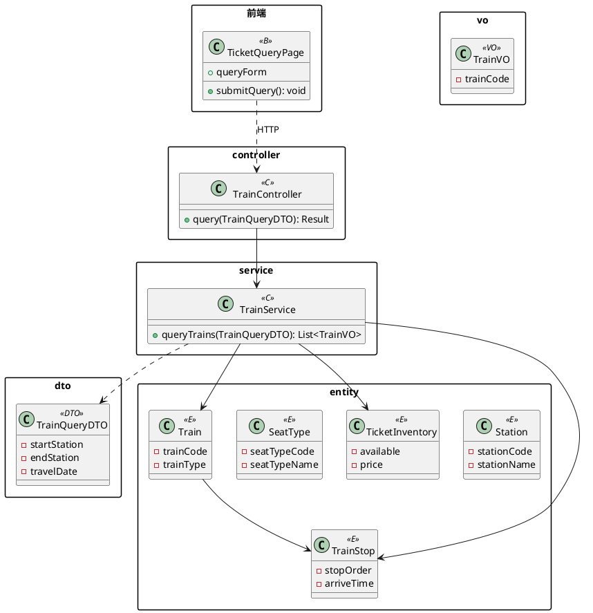
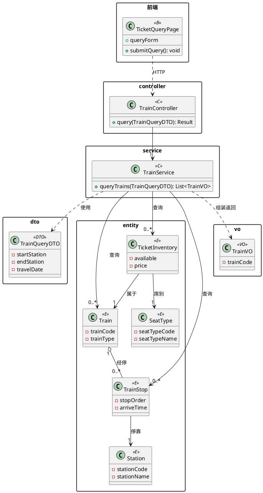
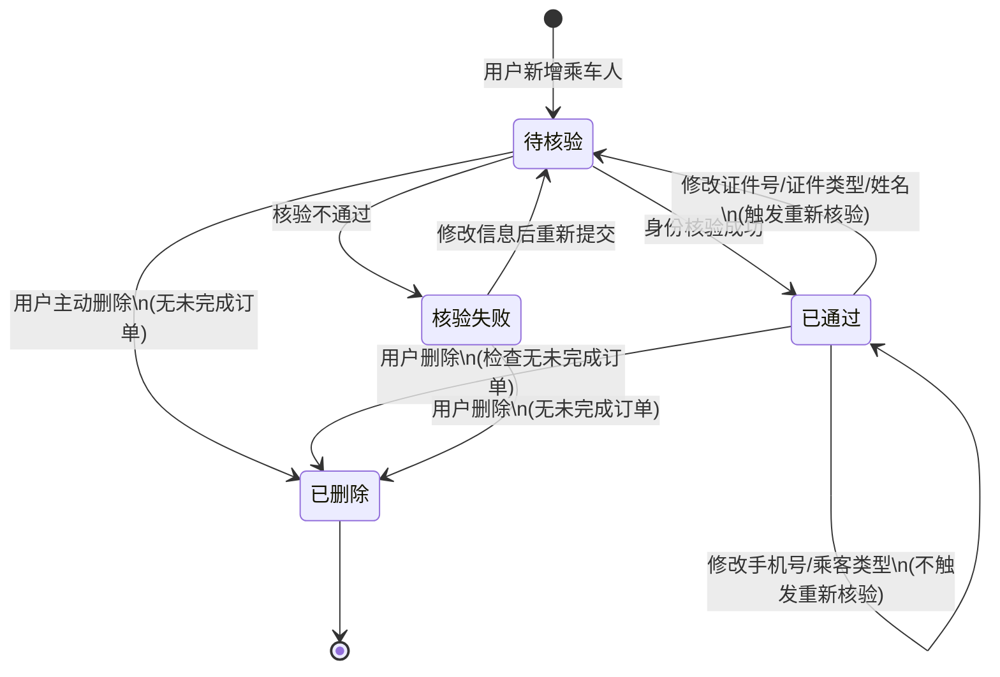

# 12306旅客管理系统 —— AI辅助软件开发实践案例

> 本文档将12306旅客管理系统中AI辅助开发的15个实践案例整合为一篇连贯读物，按**详细设计→代码实现→测试**的开发流程组织，定位为软件工程教材的配套案例参考。

---

## 引言

12306旅客管理系统是一个功能完整的火车票查询与购票平台，采用Vue 3 + Spring Boot技术栈。在开发过程中，我们系统性地尝试了多种AI辅助软件开发方式——从设计阶段的提示词工程到实现阶段的代码补全与Agent自主生成，再到测试阶段的用例与代码生成。

这些实践覆盖了两种核心的AI工作范式。第一种是**人机多轮交互**（LLM Chat + 提示词工程）：工程师主导设计方向，逐轮给AI下达精化的提示词，审阅输出后决定是接受还是修正，人在每一轮都参与决策。第二种是**Agent自主执行**：工程师设定目标与约束后，Agent自主完成项目探索、规划、代码生成与自检，人只在最终审查结果。两种范式并非孰优孰劣——它们适用于不同阶段、不同特征的任务，本文档将在具体案例中展示这一判断逻辑。

> **关于类名说明**：案例中AI输出的示例使用通用设计名称（如 `TicketQueryService`、`PassengerDTO`），便于表达业务语义；项目实际代码中对应的类名（如 `TrainServiceImpl`、`PassengerVO`）请参阅同目录下的[类名映射表](类名映射表-设计名与实际项目类名对照.md)。

---

# 第一部分：详细设计 —— 把需求变成可实现的方案

详细设计阶段的核心挑战是将自然语言需求转化为结构化的设计制品。这些任务需要大量的设计判断——哪些类参与协作、职责边界画在哪里、异常流程覆盖哪些场景。AI可以快速产出结构化初稿，但设计决策权必须握在人手里。本阶段的七个案例全部采用**人机多轮交互**范式。

---

## 案例 10.4.2：AI辅助设计"车票查询"用例实现流程

对于"车票查询"的用例实现方案，软件设计工程师可以通过与大语言模型的多轮交互进行设计。本案例以DeepSeek-V4（通过VS Code中的通义灵码插件访问）为例，介绍如何采用提示词工程的手段，通过多轮人机交互的方式，高效地获取车票查询的用例实现方案。工程师在VS Code中编写结构化提示词，大模型输出文字描述后，工程师审阅并发现问题、调整提示词重新生成，满意后使用draw.io将文字描述转化为可视化的顺序图。整个过程的核心是两轮"输入→输出→审阅→精化"的闭环。

### 第一轮对话

在第一轮对话中，工程师向大模型阐述了任务描述和功能背景，要求输出用例名称、参与者、主事件流、备选事件流和参与类及职责。

**大模型输入（第1轮）：**

```
### 任务描述
请为12306软件中的"车票查询"功能设计用例实现方案。

### 功能背景
用户输入出发地、目的地、出发日期后，系统查询符合条件的车次。每条车次展示车次号、
出发/到达站、出发/到达时间、历时、各席别余票和对应票价。支持按车次类型（G高速/
D动车/K普速）、出发时段、是否有票筛选。

### 输出要求
请输出：用例名称、参与者、主事件流、备选事件流、参与类及职责。
```

**大模型输出（第1轮）：**

```
用例名称：车票查询
参与者：旅客用户、车次信息服务、余票服务
前置条件：用户已进入车票查询页面

主事件流：
1. 用户输入出发地、目的地和出发日期
2. 系统校验输入
3. 系统根据出发站和到达站查询匹配的车次
4. 系统查询每个车次的余票信息
5. 系统返回查询结果
6. 页面展示车次列表

备选事件流：
- A1: 输入为空 → 提示用户补充
- A2: 无匹配车次 → 提示无结果

参与类及职责：
| 类名 | 职责 |
|------|------|
| TicketQueryPage | 前端页面，接收输入、展示结果 |
| TrainController | 处理查询请求 |
| TrainService | 执行查询逻辑 |
| Train | 车次数据 |
| TrainMapper | 数据库访问 |
```

工程师审阅后发现四个问题：**主事件流过粗**——"系统查询""系统返回"太笼统，未说明怎么查、返回什么，无法据此构造类图和顺序图；**备选流不全**——缺少"日期不合法""余票服务不可用"等真实场景的异常处理；**参与类遗漏**——没有区分边界类/控制类/实体类，缺少Station、TrainStop、TicketInventory、SeatType等关键实体，也没有DTO/VO值对象；**根本原因**是没有给AI讲设计原则——AI默认用"Controller→Service→Mapper"三层思维输出，但不知道边界类不应承担业务规则、实体类不应处理UI等约束。

### 第二轮对话

工程师在提示词中补充了四条关键信息：设计原则、异常场景清单、输出格式约束、业务上下文。

**大模型输入（第2轮）：**

```
### 任务描述
请为12306软件中的"车票查询"功能设计用例实现方案。

### 功能背景
用户输入出发地、目的地、出发日期后，系统查询符合条件的车次。每条车次展示：
- 车次号（如G101）
- 出发站/到达站（如北京南→上海虹桥）
- 出发时间/到达时间（如08:00-12:30）
- 历时（如4时30分）
- 各席别余票（商务座/一等座/二等座/无座等）
- 对应票价

支持按车次类型（G高速/D动车/K普速）、出发时段、是否有票筛选。

### 设计原则
1. 从用例执行流程出发设计，先梳理主事件流再补充备选流。
2. 区分边界类（负责用户交互）、控制类（协调用例流程）、实体类（表示稳定业务概念）、
   值对象（封装无ID的临时数据）。
3. 边界类不应承担复杂业务规则。
4. 控制类不应保存长期业务数据。
5. 实体类不应直接处理用户界面输入输出。
6. 考虑异常情况：查询条件为空、日期不合法、无符合条件车次、余票服务不可用。
7. 输出应便于后续构造设计类图。

### 输出要求
请输出：用例名称、参与者、前置条件、主事件流、备选事件流、参与类及职责、设计说明。
```

**大模型输出（第2轮）：**

```
用例名称：车票查询

参与者：
- 主要参与者：旅客用户
- 辅助参与者：车次信息服务、余票服务、票价服务

前置条件：
1. 用户已进入车票查询页面
2. 系统已维护车站基础数据
3. 查询日期应在系统允许的预售期范围内

主事件流：
1. 用户在查询页面输入出发地（如"北京南"）、目的地（如"上海虹桥"）和出发日期
2. 查询页面对出发/到达站名、日期格式进行基础校验
3. 查询控制器接收请求，将用户输入封装为查询条件对象
4. 查询服务根据条件，查找起始站匹配的车次
5. 对每个候选车次，查询其经停站信息，判断是否覆盖用户指定的出发站→到达站区间
6. 查询每个车次在不同日期下的各席别余票数量和对应票价
7. 控制器汇总车次基本信息、余票情况、票价，组装为结果对象列表返回
8. 查询页面将结果渲染为车次卡片列表

备选事件流：
- A1-条件不完整：出发地或目的地为空 → 前端校验阻止提交，提示"请选择出发站/到达站"
- A2-日期不合法：日期早于当天 → 返回错误提示"出行日期不能为过去日期"
- A3-无匹配车次：指定路线无可乘车次 → 返回空列表，前端展示"未查询到符合条件的车次"
- A4-余票服务异常：余票查询接口不可用 → 降级展示车次基础信息，标注"余票暂不可用"

参与类及职责：
| 类名 | 类型 | 职责描述 |
|------|------|----------|
| TicketQueryPage | 边界类 | 接收用户输入，展示查询结果，提供筛选 |
| TicketQueryController | 控制类 | 接收请求，协调查询流程，组装结果返回 |
| TicketQueryService | 控制类 | 执行查询业务逻辑：校验→查车次→查经停→查余票→组装→筛选排序 |
| TicketQueryCondition | 值对象(DTO) | 封装查询条件：出发站编码、到达站编码、出发日期、车次类型、是否只看有票 |
| Train | 实体类 | 车次基本信息：车次号、车次类型、始发站/终到站、出发/到达时间 |
| TrainStop | 实体类 | 车次经停站信息：站序、到站时间、发车时间 |
| Station | 实体类 | 车站基础数据：车站编码、车站名、城市名 |
| TicketInventory | 实体类 | 某车次+日期+席别的库存：总票数、余票数、已售数 |
| Fare | 实体类 | 某车次+席别+区段的票价 |
| SeatType | 实体类 | 席别类型：商务座/一等座/二等座/无座等 |
| TicketQueryResultVO | 值对象(VO) | 聚合查询结果：车次信息+各席别余票+票价，供前端展示 |

设计说明：
- TicketQueryController 是流程协调者，通过 TicketQueryService 整合车次、余票和票价查询
- TicketQueryCondition 封装用户输入的查询条件，在Service方法间传递
- TrainStop 通过车次ID与 Train 关联，TicketInventory 和 Fare 通过车次ID+席别与 Train 关联
- TicketQueryResultVO 只用于页面结果展示，不承担业务规则判断
```

第二轮输出相比第一轮有了质的提升：主事件流从6步细化到8步，每一步都可直接映射为顺序图中的消息交互；备选流从2个扩展到4个，每个都对应具体的错误提示文本；参与类从5个增至11个，每个都标注了类型（B/C/E/DTO/VO）。工程师在此基础上还需补充AI不知道的隐性业务规则——预售期天数（15天）、停运车次处理、候补票场景——并做出命名决策（确认TicketQuery*命名体系，后续编码阶段将沿用此体系）。最终，工程师用draw.io将文字描述转化为可视化的顺序图。

这个案例的核心启示是：**提示词的质量决定了AI输出的上限**。第一轮提示词只包含任务描述和功能背景，AI输出的主事件流笼统、备选流不全、参与类遗漏——这样的回答不足以支撑后续的类图和顺序图设计。第二轮在提示词中注入设计原则、异常场景、输出格式和业务上下文后，AI输出的细化程度和可用性有了显著提升。LLM Chat的典型工作流中，人在前置准备（梳理四要素）、逐轮审阅（发现不足并调整）、后期加工（转化为可视化制品）三个阶段都深度参与，AI是"副驾"而人是"驾驶员"。

---

## 案例 10.4.3：AI+PlantUML生成"车票查询"设计类图

在详细设计中，将参与类转化为可渲染、可修改、可版本管理的设计类图是一个关键环节。本案例同样使用DeepSeek-V4，在VS Code中安装PlantUML插件后，让大模型输出PlantUML代码而非不可编辑的图片——代码格式便于Git版本对比，也便于人工审查后直接修改。大模型生成PlantUML代码后在插件中即可预览渲染效果。本案例生成的类图定位为初版——只包含核心类、基本属性和初步关系，后续案例 10.5.3 将在此基础上精化类的语义关系和数量对应。

**大模型输入：**

```
### 任务描述
请根据12306软件"车票查询"用例实现方案，生成软件详细设计阶段的PlantUML设计类图代码。

### 已识别类
TicketQueryPage(边界类)、Controller(控制类)、Service(控制类)、
查询条件DTO(值对象)、Station(实体类)、Train(实体类)、TrainStop(实体类)、
SeatType(实体类)、余票库存(实体类)、票价(实体类)、结果VO(DTO)

### 设计要求
1. 使用 <<B>> <<C>> <<E>> <<VO>> <<DTO>> 标记类类型
2. 为每个类只补充最核心的1-3个属性即可，不需要列出全部字段
3. 标明类之间的基本依赖关系，不需要多重性标注
4. 车票查询涉及余票和票价两类不同数据，不要混在同一实体中
5. 不加入订单、支付、退票等与当前用例无关的类
6. 输出PlantUML代码
```

**大模型输出：**



AI生成的类图包含了车票查询用例的8个核心类。边界类 `TicketQueryPage` 负责接收用户输入和展示查询结果，通过HTTP协议与后端交互。控制类 `TrainController` 和 `TrainService` 协调查询流程——Controller负责接收请求和返回响应，Service负责执行具体的查询业务逻辑。值对象 `TrainQueryDTO` 封装了用户输入的查询条件，在方法间传递。实体类 `Train`、`TrainStop`、`Station`、`SeatType`、`TicketInventory` 分别表示车次、经停站、车站、席别和余票库存这些稳定的业务概念，`Train` 与 `TrainStop` 为一对多的经停关系。视图对象 `TrainVO` 用于汇总查询结果并返回前端展示。使用PlantUML代码的好处是：任何时候需要修改类图，只需编辑文本即可重新渲染，不需要重画整个图。

---

## 案例 10.5.3：AI精化"车票查询"类图关系

在案例 10.4.3 生成了车票查询初版类图之后，需要对类之间的关系进行精化——区分依赖、关联、聚合等不同的语义关系，补充多重性约束，确保关系方向符合设计原则。本案例使用DeepSeek-V4，工程师将案例 10.4.3 中生成的PlantUML类图代码作为输入，要求大模型审查并精化类间关系。

**大模型输入：**

```
### 任务描述
请审查以下"车票查询"设计类图的类间关系，并输出精化后的PlantUML代码。

### 当前类图（PlantUML代码，来自案例 10.4.3）
```plantuml
@startuml
skinparam packageStyle rectangle
package "前端" {
    class TicketQueryPage <<B>> { + queryForm; + submitQuery(): void }
}
package "controller" {
    class TrainController <<C>> { + query(TrainQueryDTO): Result }
}
package "service" {
    class TrainService <<C>> { + queryTrains(TrainQueryDTO): List<TrainVO> }
}
package "dto" {
    class TrainQueryDTO <<DTO>> { - startStation; - endStation; - travelDate }
}
package "entity" {
    class Station <<E>> { - stationCode; - stationName }
    class Train <<E>> { - trainCode; - trainType }
    class TrainStop <<E>> { - stopOrder; - arriveTime }
    class SeatType <<E>> { - seatTypeCode; - seatTypeName }
    class TicketInventory <<E>> { - available; - price }
}
package "vo" {
    class TrainVO <<VO>> { - trainCode }
}
TicketQueryPage ..> TrainController : HTTP
TrainController --> TrainService
TrainService ..> TrainQueryDTO
TrainService --> Train
TrainService --> TrainStop
TrainService --> TicketInventory
Train --> TrainStop
@enduml
```

### 精化要求
1. 区分语义关系类型：依赖（..>）用于临时使用、关联（-->）用于持久引用、聚合（o--）用于整体-部分关系
2. 为关联和聚合关系标注多重性（1, 0..*, 1..*）
3. 检查关系方向是否符合设计原则（边界类不应被实体类直接引用）
4. 补充遗漏的关系（如 TrainStop 与 Station 的引用、TicketInventory 与 Train/SeatType 的关联）
```

**大模型输出（精化后的类图）：**



精化后的类图相比初版有三处关键改进。关系语义方面，`Train` 与 `TrainStop` 的关系从简单的 `-->` 精化为 `o--`（聚合）——车次聚合了经停站，经停站是车次的一部分，标注了 `"1" o-- "0..*"` 的多重性。关系完整方面，补充了初版遗漏的 `TrainStop --> Station`（经停站引用车站信息）、`TicketInventory --> Train`（余票属于某个车次）、`TicketInventory --> SeatType`（余票关联席别类型）。设计原则方面，确认了边界类 `TicketQueryPage` 仅通过HTTP依赖控制类，不被任何实体类直接引用；`TrainService` 作为控制类与实体类的关联方向是合理的（控制类引用实体类，反之则不行）。

---

## 案例 10.5.4：AI补全"乘车人"类属性、类型、约束和可见性

类属性设计不只是列字段名和类型——还需要说明每个属性的可见性、约束条件和设计理由。本案例使用DeepSeek-V4，工程师先整理了12306项目实际支持的8种证件类型及其差异化额外字段要求（如外国护照需要国籍+出生日期+性别+有效期+邮箱），然后编写提示词要求大模型以表格形式输出属性设计。大模型输出覆盖18个字段的属性定义后，工程师对照项目中的schema.sql验证字段完整性和索引建议是否正确。

类属性设计不只是列字段名和类型——还需要说明可见性、约束条件和设计理由。乘车人实体需支持8种证件类型，不同类型的额外字段要求各不相同。

**大模型输入：**

```
### 任务描述
请为12306软件"乘车人管理"中的Passenger类精化属性。

### 类职责
Passenger表示一个用户管理的乘车人，用于购票、订单关联和乘车人列表展示。
对应Java 17 + Spring Boot 3.2 + MyBatis-Plus项目，数据库表为passengers。

### 已有的8种证件类型（IdType枚举）
ID_CARD(身份证)、HK_MACAO_RESIDENCE(港澳居住)、TAIWAN_RESIDENCE(台湾居住)、
FOREIGN_PERMANENT(外国人永居)、HK_MACAO_PASS(港澳通行)、TAIWAN_PASS(台湾通行)、
CHINA_PASSPORT(中国护照)、FOREIGN_PASSPORT(外国护照)

不同证件类型的额外字段要求：
- ID_CARD/HK_MACAO_RESIDENCE/TAIWAN_RESIDENCE：只需基础字段
- FOREIGN_PERMANENT/HK_MACAO_PASS/TAIWAN_PASS：需国籍+出生日期+性别+有效期
- CHINA_PASSPORT：需出生日期+性别+有效期
- FOREIGN_PASSPORT：需国籍+出生日期+性别+有效期+邮箱

### 设计要求
1. 属性应支持数据库持久化（MyBatis-Plus映射）
2. 类型以Java 17为标准
3. 每个属性说明可见性、类型、约束和设计理由
4. 考虑证件号和手机号的隐私保护，但实体类不保存脱敏值
5. 区分"数据库字段"和"计算属性/辅助方法"
```

**大模型输出（属性设计表，精简）：**

| 属性 | Java类型 | 约束 | 设计理由 |
|------|---------|------|---------|
| id | Long | PK, AUTO_INCREMENT | 代理主键 |
| userId | Long | NOT NULL, INDEX | 归属用户，所有查询都带此条件 |
| name | String | NOT NULL, VARCHAR(50) | 乘车人姓名 |
| idType | String | NOT NULL, VARCHAR(30) | 证件类型，枚举值 |
| idCard | String | NOT NULL, VARCHAR(100) | 证件号原始值，脱敏在展示层处理 |
| phone | String | VARCHAR(20) | 手机号原始值，脱敏在展示层处理 |
| passengerType | String | NOT NULL, DEFAULT 'ADULT' | 成人/儿童/学生/残军 |
| nationality | String | VARCHAR(50), NULLABLE | 仅外籍证件需要 |
| birthDate | LocalDate | NULLABLE | 部分证件类型需要 |
| gender | Integer | TINYINT, NULLABLE | 0未知/1男/2女 |
| expireDate | LocalDate | NULLABLE | 证件有效期，非所有证件类型都有 |
| email | String | VARCHAR(100), NULLABLE | 仅外国护照需要 |
| isDefault | Boolean | NOT NULL, DEFAULT false | 是否默认乘车人 |
| isVerified | Boolean | NOT NULL, DEFAULT false | 是否已通过身份核验 |
| isDeleted | Boolean | NOT NULL, DEFAULT false | 逻辑删除标记 |

AI还建议了索引设计：`(user_id, id_card)` 联合唯一索引用于防重复添加，`(user_id, is_deleted)` 复合索引用于列表查询。关键设计决策包括：实体类保存原始证件号和手机号而不保存脱敏值（脱敏是展示层职责），`gender` 使用 `TINYINT` 枚举映射而非字符串，以及不同证件类型的 `NULLABLE` 差异化处理。AI在根据约束条件进行系统性查漏补缺方面表现出色——不会遗漏"港澳通行证需要国籍字段"这种因证件类型而异的约束。

---

## 案例 10.5.5：AI设计"车票查询"类方法签名与职责边界

方法设计中最容易出现的问题不是"方法不够多"，而是方法放在了错误的类中。本案例使用DeepSeek-V4，工程师列出了车票查询涉及的8个已有类（TrainController、TrainQueryDTO、TrainService、Train、TrainStop、TicketInventory、Station、TrainVO）和5条设计原则（如Controller只做请求-响应映射、实体类只处理自身数据），要求大模型为每个类设计方法签名并标注职责类型。大模型输出14个方法签名及职责说明表后，工程师核对了方法签名与项目实际接口的一致性，确认每个方法的职责归属是否合理。

方法设计中最容易出现的问题不是"方法不够多"，而是**方法放在了错误的类中**。车票查询涉及条件校验、车次查询、经停站查询、余票查询、票价查询和结果组装六个步骤，需要合理分配到不同类中。

**大模型输入：**

```
### 任务描述
请为12306软件"车票查询"功能中的核心类设计方法。

### 已有类
TrainController — REST控制器，处理 POST /api/trains/query
TrainQueryDTO — 查询条件：startStation/endStation/travelDate/trainType
TrainService — 应用服务，协调查询流程
Train — 车次实体：trainCode/trainType/startStation/endStation/startTime/endTime/totalTime
TrainStop — 经停站实体：trainId/stationId/stopOrder/arriveTime/departTime
TicketInventory — 余票实体：trainId/travelDate/seatTypeCode/available/price
Station — 车站实体：stationCode/stationName/cityName/pinyin
TrainVO — 前端展示对象：聚合车次+余票+票价信息

### 设计原则
1. Controller方法只做请求-响应映射，不写业务逻辑
2. Service方法负责协调多步骤查询流程
3. 实体类方法只处理与自身数据相关的业务判断
4. 值对象方法负责校验自身数据合法性
5. 方法签名使用Java风格，返回类型明确

### 输出格式
| 所属类 | 方法签名 | 方法类型 | 职责说明 |
```

**大模型输出（核心方法，精简）：**

| 所属类 | 方法签名 | 方法类型 | 职责说明 |
|--------|---------|---------|---------|
| TrainController | `query(TrainQueryDTO): Result<List<TrainVO>>` | 请求映射 | 接收POST请求，调用Service，包装Result返回 |
| TrainQueryDTO | `validate(): List<String>` | 校验方法 | 校验自身字段合法性，返回错误信息列表 |
| TrainService | `queryTrains(TrainQueryDTO): List<TrainVO>` | 协调查询 | 串联校验→查车次→查经停→查余票→组装→筛选→排序 |
| TrainService | `validateCondition(TrainQueryDTO): void` | 校验方法 | 校验必填字段和日期合法性 |
| TrainService | `findTrainsByRoute(TrainQueryDTO): List<Train>` | 查询方法 | 通过经停站匹配出发站和到达站 |
| TrainService | `buildTrainVO(Train, LocalDate): TrainVO` | 组装方法 | 将实体+余票组装为前端展示VO |
| TrainService | `filterAvailable(List<TrainVO>, boolean): List<TrainVO>` | 筛选方法 | "只看有票"筛选 |
| Train | `hasStopAt(String stationCode): boolean` | 判断方法 | 判断车次是否经停指定车站 |
| TicketInventory | `isAvailable(): boolean` | 判断方法 | 判断当前库存是否有余票（available > 0） |

AI严格遵循了设计原则：Controller只有一行请求映射，Service承担了全部协调整合，实体类方法只处理自身数据（`Train.hasStopAt`、`TicketInventory.isAvailable`），DTO自带校验。每个方法标注了类型（构造器/查询/判断/转换/校验），显式化了"为什么这个方法放在这个类而不是那个类"的设计理由。

---

## 案例 10.5.6：AI+Mermaid生成"乘车人"对象状态图

状态图的价值在于明确对象的生命周期，防止出现非法状态转换。本案例使用DeepSeek-V4，工程师梳理了乘车人对象的7条业务规则（新建→待核验→核验通过/失败→修改关键信息触发重新核验→删除前检查未完成订单→已删除不可恢复），要求大模型输出Mermaid stateDiagram-v2代码而非图片——纯文本格式便于嵌入Markdown文档和Git版本管理。大模型输出Mermaid代码和状态转换条件说明表后，工程师在VS Code的Markdown预览中查看渲染效果，逐一确认状态转换逻辑是否与业务规则完全一致。

乘车人对象从新建到删除，在不同业务操作下经历多个状态转移。状态图的价值在于明确对象生命周期，防止非法状态转换（如已删除的乘车人被用于购票）。

**大模型输入：**

```
### 任务描述
请为12306软件中的Passenger乘车人对象构造状态图。

### 业务规则
1. 用户新增乘车人后，乘车人进入"待核验"状态
2. 身份信息核验成功后，进入"已通过"状态，可用于购票
3. 核验失败后，进入"核验失败"状态，用户可修改信息后重新提交核验
4. 对"已通过"的乘车人修改证件号等关键信息后，需重新核验（回到"待核验"）
5. 删除乘车人前需检查是否存在未完成订单（待支付/已支付未出行）
6. 已删除乘车人不可购票，也不允许恢复到任何业务状态
7. 乘客类型变更（如儿童→成人）不触发重新核验

### 输出要求
1. Mermaid stateDiagram-v2 代码
2. 状态转换条件说明表
```

**大模型输出（Mermaid状态图代码）：**



Mermaid代码是纯文本格式，可直接嵌入Markdown文档由渲染器自动生成可视化状态图。相比draw.io等图形工具，Mermaid更适合AI生成（无需布局坐标）和版本管理（diff可读）。AI严格遵循了业务规则：修改证件号触发重新核验→回到"待核验"；乘客类型变更→"已通过"自循环不转移；所有到"已删除"的转换都标注了"无未完成订单"条件。

---

## 案例 10.6.4：AI设计"乘车人管理"和"车票查询"数据操作

本案例使用DeepSeek-V4，工程师从项目schema.sql中提取了6张相关数据表的结构（passengers、trains、train_stops、stations、ticket_inventory、seat_types），连同业务约束（重复证件号检查、30人上限、未完成订单拦截）一起提交给大模型，要求使用伪SQL描述数据操作流程——伪SQL避免与具体ORM框架绑定，重点表达操作步骤、事务边界和隐私保护点。大模型输出了添加、修改、删除、列表查询和车票查询五个操作的伪SQL流程后，工程师对照实际数据库表结构验证了字段名和约束是否正确。

数据操作设计不只是写表结构——还要说明何时查、何时插、何时更新，哪些操作需要放在同一事务中。

**大模型输入：**

```
### 任务描述
请为12306软件中的"乘车人管理"和"车票查询"功能设计数据操作。

### 数据表（来自项目schema.sql）
passengers — id, user_id, name, id_type, id_card, passenger_type, phone,
            nationality, birth_date, gender, expire_date, email, is_default,
            is_verified, is_deleted, create_time, update_time
trains — id, train_code, train_type, start_station_name, end_station_name,
         start_time, end_time, total_time, total_stops
train_stops — id, train_id, station_id, stop_order, arrive_time, depart_time
stations — id, station_code, station_name, city_name, pinyin, is_high_speed
ticket_inventory — id, train_id, travel_date, seat_type, total, available, sold, price
seat_types — id, seat_type_code, seat_type_name, base_price

### 设计要求
1. 使用伪SQL描述操作步骤（不绑定具体ORM）
2. 标注哪些操作需要事务
3. 标注隐私保护点（脱敏、权限过滤）
4. 考虑30人上限、重复证件号、未完成订单检查等业务约束
```

**大模型输出（乘车人添加操作示例）：**

```
操作：添加乘车人  [需要事务]

1. 检查重复证件号：
   SELECT COUNT(*) FROM passengers
   WHERE user_id = ? AND id_card = ? AND is_deleted = 0

2. 检查30人上限：
   SELECT COUNT(*) FROM passengers
   WHERE user_id = ? AND is_deleted = 0

3. 插入乘车人：
   INSERT INTO passengers (user_id, name, id_type, id_card, passenger_type,
       phone, nationality, birth_date, gender, expire_date, email)
   VALUES (?, ?, ?, ?, ?, ?, ?, ?, ?, ?, ?)

4. 事务提交

操作：删除乘车人  [需要事务]

1. 查出乘车人信息：
   SELECT id_card, name FROM passengers WHERE id = ? AND is_deleted = 0

2. 检查未完成订单：
   SELECT COUNT(*) FROM orders
   WHERE passenger_id = ? AND status IN ('PENDING', 'PAID')

3. 逻辑删除：
   UPDATE passengers SET is_deleted = 1, update_time = NOW() WHERE id = ?

操作：车票查询（多表关联）

1. 站名→站码：
   SELECT station_code FROM stations WHERE station_name = ?  -- 出发站
   SELECT station_code FROM stations WHERE station_name = ?  -- 到达站

2. 匹配车次（通过经停站）：
   SELECT DISTINCT t.* FROM trains t
   JOIN train_stops ts1 ON t.id = ts1.train_id AND ts1.station_id = ?
   JOIN train_stops ts2 ON t.id = ts2.train_id AND ts2.station_id = ?
   WHERE ts1.stop_order < ts2.stop_order

3. 逐车次查余票和票价：
   SELECT ti.*, st.seat_type_name FROM ticket_inventory ti
   JOIN seat_types st ON ti.seat_type = st.seat_type_code
   WHERE ti.train_id = ? AND ti.travel_date = ?
```

AI的设计涵盖了乘车人管理4个操作（添加/修改/删除/列表查询）和车票查询的多表关联流程。关键决策包括：添加操作在事务中先查重复证件号和30人上限再插入；删除使用逻辑删除（`is_deleted=1`）而非物理删除；车票查询将车次基础查询和余票查询分离——前者一次查出所有匹配车次，后者逐车次查询。隐私保护点标注在列表查询步骤中：查询结果返回前需调用PrivacyService对证件号和手机号进行脱敏。

---

# 第二部分：代码实现 —— 从设计到可运行代码

设计文档确定后进入编码阶段。AI在实现阶段可以发挥不同层次的作用——从最轻量的代码补全到重量级的Agent自主生成。本部分的五个案例展示了这些不同层次的应用。

---

## 案例 12.7.1(1)：AI辅助代码补全——乘车人证件号脱敏

代码补全是AI辅助开发中最常见的方式。本案例使用GitHub Copilot和通义灵码（JetBrains AI Assistant也可达到同样效果），工程师在IDE中创建PassengerPrivacyService.java，先编写详细的Javadoc注释——包括四条脱敏规则、边界条件处理（null和空白）、具体示例（"12345678" → "12****78"）——然后由Copilot根据注释自动生成方法体。证件号脱敏方法补全后，工程师用注释中的示例立即验证结果，再以同样的方式完成手机号脱敏方法的补全。最后将脱敏服务集成到PassengerServiceImpl的列表查询中。这类补全的适用条件很明确：函数逻辑可用规则穷举描述、输入输出类型明确、不依赖外部服务或数据库。

代码补全是AI辅助开发中最常见、最轻量的方式。证件号脱敏属于局部、规则明确、上下文较少的小函数——非常适合使用IDE中的AI代码补全完成。工程师在IDE中编写详细的Javadoc注释描述脱敏规则，然后触发AI自动补全方法体。

**大模型输入（IDE中编写的Javadoc注释+方法签名）：**

```java
package com.railway.service;

import org.springframework.stereotype.Service;

/**
 * 乘车人隐私保护服务
 * 集中管理证件号和手机号的脱敏规则
 */
@Service
public class PassengerPrivacyService {

    /**
     * 对身份证号进行脱敏。
     * 规则：
     * 1. 如果证件号为空或空白字符串，返回空字符串。
     * 2. 如果长度 <= 4，返回 "****"。
     * 3. 如果长度 <= 8，保留前2位和后2位，中间用 **** 代替。
     *    示例："12345678" → "12****78"
     * 4. 如果长度 > 8，保留前4位和后4位，中间用 ******** 代替。
     *    示例："110101199001011234" → "1101********1234"
     *
     * @param idCardNo 原始证件号码
     * @return 脱敏后的证件号码
     */
    public String maskIdCardNo(String idCardNo) {
        // AI补全区域
    }

    /**
     * 对手机号进行脱敏。
     * 规则：
     * 1. null或空白 → 返回空字符串
     * 2. 11位手机号 → "138****8000" (保留前3后4)
     * 3. 非11位 → 仅保留首尾各1位，中间全星号
     *
     * @param phone 原始手机号
     * @return 脱敏后的手机号
     */
    public String maskPhone(String phone) {
        // AI补全区域
    }
}
```

**大模型输出（AI自动补全的方法体）：**

```java
public String maskIdCardNo(String idCardNo) {
    // 规则1: 空值/空白处理
    if (idCardNo == null || idCardNo.isBlank()) {
        return "";
    }

    int length = idCardNo.length();

    // 规则2: 长度 <= 4
    if (length <= 4) {
        return "****";
    }

    // 规则3: 长度 <= 8，保留前2后2
    if (length <= 8) {
        return idCardNo.substring(0, 2)
                + "****"
                + idCardNo.substring(length - 2);
    }

    // 规则4: 长度 > 8，保留前4后4
    return idCardNo.substring(0, 4)
            + "********"
            + idCardNo.substring(length - 4);
}

public String maskPhone(String phone) {
    if (phone == null || phone.isBlank()) {
        return "";
    }

    int length = phone.length();

    if (length == 11) {
        // 中国大陆手机号：138****8000
        return phone.substring(0, 3)
                + "****"
                + phone.substring(7);
    }

    // 非标准长度：只保留首尾各1位
    return phone.charAt(0)
            + "*".repeat(Math.max(0, length - 2))
            + phone.charAt(length - 1);
}
```

AI生成的代码与注释中描述的规则完全一致——这正是写好注释的价值：**足够详细的Javadoc不仅是文档，也是给AI的"规格说明"**。生成后工程师用预期结果速查表立即验证：`maskIdCardNo(null)→""`、`maskIdCardNo("12345678")→"12****78"`、`maskPhone("13800138000")→"138****8000"`——注释中的示例就是天然的测试用例。这类补全的适用条件很明确：函数逻辑可用规则穷举描述、输入输出类型明确、不依赖外部服务或数据库。工程师只需在注释中写清楚所有边界条件（含null处理），让AI完成机械性的实现。

---

## 案例 12.7.1(2)：Agent自主生成——车票查询Service类完整代码框架

当任务涉及多个已有文件的上下文时，LLM Chat模式需要工程师手动收集和粘贴所有相关代码，效率低且容易产生幻觉。本案例切换到了Agent自主执行的工作范式——使用TRAE Agent（基于DeepSeek-V4，集成在VS Code中），工程师只需编写精确的提示词（6条业务规则+4条约束：不生成Controller、不改数据库表结构、复用已有Mapper、使用MyBatis-Plus LambdaQueryWrapper），Agent会自动搜索项目中的Mapper和Entity、读取文件确认字段和方法签名、规划方法调用链、生成完整代码。工程师收到约200行的TicketQueryServiceImpl后运行mvn compile验证编译通过，然后用五层审查框架（编译→API一致性→业务完整性→性能→命名）逐层检查，发现Agent在性能层面存在盲区（buildTrainVO逐车次查余票的N+1查询问题）和命名不一致（TicketQueryServiceImpl vs 项目实际的TrainServiceImpl）。

当任务涉及多个已有文件的上下文时，LLM Chat需要工程师手动收集和粘贴所有相关代码，效率低且容易产生幻觉。本案例切换到**Agent自主执行**范式——车票查询Service需要协调5个已有Mapper、3个Entity和2个DTO，正是Agent模式的优势场景。

**大模型输入（Agent提示词）：**

```
请基于当前项目结构（com.railway），在 service/impl/ 下生成或完善 TicketQueryServiceImpl。

### 业务规则
1. 输入：TrainQueryDTO（startStation, endStation, travelDate, trainType, onlyAvailable）
2. 校验：出发站/到达站/日期必填，日期不可为过去
3. 查询：通过TrainMapper查询trains表，通过TrainStopMapper查询经停站
4. 余票：通过ticket_inventory表查询指定日期+车次的各席别余票和票价
5. 组装：将Train + TrainStop + TicketInventory 组装为 TrainVO 列表
6. 筛选：如 onlyAvailable=true，过滤掉所有席别available=0的车次
7. 排序：按出发时间升序返回

### 约束
- 不要生成Controller，Controller已有
- 不要修改数据库表结构
- 优先复用已有 Mapper（TrainMapper, TrainStopMapper, SeatTypeMapper）
- 使用 MyBatis-Plus LambdaQueryWrapper 构建查询
- 返回类型为 List<TrainVO>

### 输出
生成完整的 TicketQueryServiceImpl.java，包含：
- 主方法 queryTrains
- 私有辅助方法（校验、组装、筛选）
```

**大模型输出（Agent生成的完整代码）：**

```java
@Service
public class TicketQueryServiceImpl implements TrainService {

    private static final Logger log = LoggerFactory.getLogger(TicketQueryServiceImpl.class);
    private final TrainMapper trainMapper;
    private final TrainStopMapper trainStopMapper;
    private final SeatTypeMapper seatTypeMapper;

    public TicketQueryServiceImpl(TrainMapper trainMapper,
                                   TrainStopMapper trainStopMapper,
                                   SeatTypeMapper seatTypeMapper) {
        this.trainMapper = trainMapper;
        this.trainStopMapper = trainStopMapper;
        this.seatTypeMapper = seatTypeMapper;
    }

    /**
     * 车票查询主方法：串联校验→查询→组装→筛选→排序5个步骤
     */
    public List<TrainVO> queryTrains(TrainQueryDTO condition) {
        validateCondition(condition);                               // Step 1: 校验
        List<Train> trains = findTrainsByRoute(condition);          // Step 2: 查询车次
        List<TrainVO> results = trains.stream()
                .map(train -> buildTrainVO(train, condition.getTravelDate()))
                .collect(Collectors.toList());                      // Step 3: 组装VO
        if (Boolean.TRUE.equals(condition.getOnlyAvailable())) {
            results = filterAvailable(results);                     // Step 4: 筛选
        }
        results.sort(Comparator.comparing(TrainVO::getStartTime));  // Step 5: 排序
        log.info("车票查询: {}→{}, 日期={}, 结果数={}",
                condition.getStartStation(), condition.getEndStation(),
                condition.getTravelDate(), results.size());
        return results;
    }

    private void validateCondition(TrainQueryDTO condition) {
        if (condition == null) throw new IllegalArgumentException("查询条件不能为空");
        if (condition.getStartStation() == null || condition.getStartStation().isBlank())
            throw new IllegalArgumentException("出发站不能为空");
        if (condition.getEndStation() == null || condition.getEndStation().isBlank())
            throw new IllegalArgumentException("到达站不能为空");
        if (condition.getTravelDate() == null)
            throw new IllegalArgumentException("出发日期不能为空");
        if (LocalDate.parse(condition.getTravelDate()).isBefore(LocalDate.now()))
            throw new IllegalArgumentException("出行日期不能为过去日期");
    }

    // ... 其他辅助方法：findTrainsByRoute(使用LambdaQueryWrapper查询)、
    //     buildTrainVO(组装实体为VO，TODO标记ticket_inventory实时查询预留扩展点)、
    //     filterAvailable(Stream过滤无票车次)、calculateDuration(计算历时) ...
}
```

与LLM Chat不同，Agent在收到目标后自主完成了五个阶段的工作，通过工具调用日志可还原其推理轨迹。**Think阶段**：解析技术栈和约束边界。**Explore阶段**：通过Glob搜索 `com/railway/mapper/**` 发现已有Mapper，逐个Read确认方法签名和字段名——全程约30秒（人工收集同样信息约需15-20分钟）。**Plan阶段**：设计5个方法的调用链。**Generate阶段**：生成约200行代码，对未找到的 `ticket_inventory` 对应Mapper标记了TODO而非编造。**Self-Check阶段**：确认构造器注入、未生成Controller、返回类型与接口一致。

然而Agent输出仍需人工审查。工程师用五层框架审查后发现：L1编译通过✅；L2 API一致性确认 `selectList` 确是MyBatis-Plus自带方法✅；L3业务完整性确认5步骤完整✅；L4性能审查发现 `buildTrainVO` 逐车次查余票存在**N+1查询问题**——Agent关注"功能正确"胜于"性能优化"❌；L5命名一致性发现 `TicketQueryServiceImpl` 与项目实际的 `TrainServiceImpl` 命名风格不一致⚠️。

**为什么本案例用Agent而不是LLM Chat？** 车票查询Service涉及5个已有Mapper + 3个Entity + 2个DTO的跨文件协调。如果人工粘贴这些文件给LLM Chat，约需15-20分钟且可能遗漏；Agent自主搜索项目约30秒且基于真实文件生成，避免了"编造不存在的类名"的幻觉。选型依据——这个任务三个条件全中：上下文广（≥3个文件）、约束多（明确"不要改什么"）、可自动验证（mvn compile）。

---

## 案例 12.7.2：代码片段重用与适配——订单分页逻辑迁移到乘车人列表

软件开发中常需复用已有代码。本案例使用ChatGPT的代码改写能力（Copilot Chat或Cursor也能完成），工程师将OrderServiceImpl中已实现的分页查询代码复制出来，明确列出乘车人场景的三个差异点——需要过滤已逻辑删除记录（is_deleted=0）、按默认乘车人优先排序（is_default DESC）、返回前对证件号和手机号脱敏——然后提交给大模型要求适配。大模型输出适配后的代码后，工程师对照差异点逐条验证：确认LambdaQueryWrapper中新增了is_deleted条件、排序字段已修改、Stream map中注入了PrivacyService脱敏调用，最后集成到PassengerServiceImpl中。

软件开发的日常工作中常需"找一个已有的相似代码，改吧改吧变成新的"。这类任务AI在模式识别方面有天然优势，但需要工程师明确列出差异点。

**大模型输入：**

```
### 任务描述
请将下面的"订单列表分页查询"代码适配为"乘车人列表分页查询"。

### 原代码（来自OrderServiceImpl.getOrderList）
```java
public List<OrderVO> getOrderList(Long userId, Integer status) {
    List<Order> orders;
    if (status != null) {
        orders = this.lambdaQuery()
                .eq(Order::getUserId, userId)
                .eq(Order::getOrderStatus, status)
                .orderByDesc(Order::getCreateTime)
                .list();
    } else {
        orders = this.lambdaQuery()
                .eq(Order::getUserId, userId)
                .orderByDesc(Order::getCreateTime)
                .list();
    }
    return orders.stream()
            .map(order -> {
                List<OrderItem> items = orderItemMapper.selectList(
                    new LambdaQueryWrapper<OrderItem>()
                        .eq(OrderItem::getOrderId, order.getId())
                );
                return convertToVO(order, items);
            })
            .collect(Collectors.toList());
}
```

### 新业务要求
1. 根据userId查询该用户的乘车人列表（从passengers表）
2. 不返回已逻辑删除的乘车人（is_deleted字段）
3. 证件号码和手机号在返回前必须脱敏（调用PassengerPrivacyService）
4. 保留分页结构（Page + PageResult模式）
```

**大模型输出（适配后的乘车人分页查询代码）：**

```java
public PageResult<PassengerVO> getPassengerList(Long userId, Integer page, Integer size) {
    // 复用点：LambdaQueryWrapper分页查询模式
    Page<Passenger> pageParam = new Page<>(page, size);
    Page<Passenger> result = this.lambdaQuery()
            .eq(Passenger::getUserId, userId)
            .eq(Passenger::getIsDeleted, 0)          // 修改点1：过滤已逻辑删除
            .orderByDesc(Passenger::getIsDefault)     // 修改点2：默认乘车人置顶
            .orderByDesc(Passenger::getCreateTime)
            .page(pageParam);

    // 复用点：Stream map转换为VO
    List<PassengerVO> voList = result.getRecords().stream()
            .map(p -> {
                PassengerVO vo = convertToVO(p);
                // 修改点3：敏感字段脱敏
                vo.setIdCard(privacyService.maskIdCardNo(p.getIdCard()));
                vo.setPhone(privacyService.maskPhone(p.getPhone()));
                return vo;
            })
            .collect(Collectors.toList());

    return new PageResult<>(voList, result.getTotal(), page, size);
}
```

AI准确识别了三个关键修改点：增加 `.eq(Passenger::getIsDeleted, 0)` 过滤逻辑删除、排序改为默认乘车人优先、Stream map中注入PrivacyService脱敏。这个案例的启示是：**提交代码适配任务时必须明确列出"差异点"**——如果只说"适配成乘车人分页"，AI可能只做机械的变量名替换而遗漏脱敏和逻辑删除等业务差异。明确列出差异后，AI的模式识别能力可以准确完成适配。

---

## 案例 12.7.3(1)：AI辅助缺陷定位——"只看有票"筛选失效

AI辅助调试的关键不是笼统地说"筛选功能坏了"，而是提供实际行为、期望行为和相关代码片段，让AI基于证据精确定位。本案例使用ChatGPT（Claude Code或IDE Debug Assistant也可胜任），工程师收集了用户反馈（勾选"只看有票"后仍看到无票车次），定位到TicketQueryServiceImpl的filterAvailable方法，提取相关代码片段后向大模型提交了四个要素：实际行为（onlyAvailable=true时所有结果都被保留）、期望行为（勾选时只展示有票的）、代码片段（filter Lambda表达式）、输入示例（onlyAvailable=true, availableCount=0）。大模型用4行真值表在1分钟内定位到缺陷——filter表达式使用了`||`（OR）运算符导致表达式恒为true——并给出了修复方案（改为`!condition.isOnlyAvailable() || ...`）和应补充的测试用例。

"只看有票"是车票查询中常用的筛选条件。用户反馈勾选后仍看到余票为0的车次。AI辅助调试的关键不是笼统地说"筛选功能坏了"，而是**提供实际行为、期望行为和相关代码片段**，让AI基于证据精确定位。

**大模型输入：**

```
### 任务描述
请帮助定位12306车票查询功能中"只看有票"筛选失效的问题。

### 用户反馈
用户勾选"只看有票"复选框后，页面仍然显示余票数量为0（availableCount=0）的车次。

### 相关代码（来自TicketQueryServiceImpl.filterAvailable的简化版本）
```java
return trains.stream()
        .flatMap(train -> buildResults(train, condition).stream())
        .filter(result -> condition.isOnlyAvailable()
                || result.getAvailableCount() > 0)
        .toList();
```

### 输入示例
- condition.isOnlyAvailable() = true
- result.getAvailableCount() = 0  ← 这个结果预期被过滤

### 期望行为
- 当 onlyAvailable = true 时 → 只展示 availableCount > 0 的结果
- 当 onlyAvailable = false 时 → 展示全部结果（包括 availableCount = 0 的）

### 实际行为
- onlyAvailable = true 时 → 所有结果都被保留（包括 availableCount = 0 的）

### 输出要求
1. 指出最可能的缺陷位置（精确到表达式）
2. 用真值表说明缺陷原因
3. 给出最小修复方案
4. 给出应补充的测试用例
```

**大模型输出：**

```
1. 缺陷位置：filter Lambda 表达式
   .filter(result -> condition.isOnlyAvailable()
           || result.getAvailableCount() > 0)

2. 真值表分析：

| onlyAvailable | availableCount>0 | onlyAvailable \|\| count>0 | 预期行为 | 是否一致 |
|:---:|:---:|:---:|:---:|:---:|
| true | true (5) | true ✅ 保留 | 保留 | ✅ |
| true | false (0) | true ❌ 保留 | 过滤 | ❌ 缺陷！ |
| false | true (5) | true ✅ 保留 | 保留 | ✅ |
| false | false (0) | true ✅ 保留 | 保留 | ✅ |

缺陷原因：当 onlyAvailable=true 时，OR短路求值导致表达式恒为true，
所有结果（包括余票为0的）都被保留。

正确逻辑应为：!onlyAvailable || (onlyAvailable && count > 0)
简化后：!condition.isOnlyAvailable() || result.getAvailableCount() > 0

3. 最小修复方案：
-    condition.isOnlyAvailable() || result.getAvailableCount() > 0
+    !condition.isOnlyAvailable() || result.getAvailableCount() > 0

4. 应补充的测试用例：

| 用例编号 | onlyAvailable | availableCount | 预期结果 |
|----------|:---:|:---:|:---:|
| TC-FILTER-01 | true | 0 | 被过滤 |
| TC-FILTER-02 | true | 5 | 被保留 |
| TC-FILTER-03 | false | 0 | 被保留 |
| TC-FILTER-04 | false | 5 | 被保留 |
| TC-FILTER-05 | true | null | 被过滤 (防御null) |
```

AI用4行真值表在1分钟内精确定位了问题——`||`（OR）运算符导致 `onlyAvailable=true` 时表达式恒为true。正确逻辑应为"不勾选时保留全部，勾选时仅保留有票"，即 `!condition.isOnlyAvailable() || result.getAvailableCount() > 0`——只需加一个 `!` 取反。这个案例揭示了一条普遍规律：**布尔表达式是代码中最常见的小缺陷源**——`||` 和 `&&` 的混淆、取反 `!` 的位置错误、优先级问题——AI擅长做系统性的真值枚举和逻辑推导，这正是人类容易因思维惯性跳过的工作。

---

## 案例 12.7.3(2)：AI辅助程序修复——"只看有票"筛选补丁

布尔表达式缺陷定位之后，修复本身往往只需一行代码，但完整的修复流程还包括生成补丁、验证修复和补充测试用例以防回归。本案例使用ChatGPT（Claude Code同样适用），工程师将缺陷定位结果（`||`误用为`&&`语义）提交给大模型，要求生成完整的修复补丁。大模型输出了三个层次的修复内容：最小修复（一行diff，condition.isOnlyAvailable()前加`!`取反）、防御性增强（增加null检查防止NullPointerException）、测试防护（3个JUnit测试用例覆盖真值表4种组合+null防御）。工程师审查null处理逻辑后运行测试，验证修复覆盖了所有场景。

布尔表达式缺陷定位之后，修复本身往往只需一行代码。但完整的修复还包括生成补丁、验证修复和补充测试用例以防回归。本案例展示如何让AI完成从定位到修复到测试的完整流程。

**大模型输入：**

```
### 任务描述
请根据缺陷定位结果，为"只看有票"筛选失效问题生成完整的修复补丁。

### 缺陷位置
TicketQueryServiceImpl.filterAvailable() 中的 filter 表达式：
condition.isOnlyAvailable() || result.getAvailableCount() > 0
应改为：!condition.isOnlyAvailable() || result.getAvailableCount() > 0

### 输出要求
1. 生成完整的修复后方法代码
2. 包含null防御增强
3. 生成对应的JUnit测试代码
```

**大模型输出（修复后的方法+测试）：**

```java
// 修复后的 filterAvailable 方法
private List<TrainVO> filterAvailable(List<TrainVO> results, boolean onlyAvailable) {
    return results.stream()
            .filter(vo -> !onlyAvailable
                    || (vo.getTotalAvailable() != null && vo.getTotalAvailable() > 0))
            .collect(Collectors.toList());
}

// JUnit测试
@Test
@DisplayName("勾选只看有票时应过滤无票车次")
void shouldFilterNoTicketWhenOnlyAvailableIsTrue() {
    List<TrainVO> results = List.of(
        createMockVO("G101", 0),  // 无票
        createMockVO("G102", 5)   // 有票
    );
    List<TrainVO> filtered = filterAvailable(results, true);
    assertEquals(1, filtered.size());
    assertEquals("G102", filtered.get(0).getTrainCode());
}

@Test
@DisplayName("未勾选只看有票时应展示全部车次")
void shouldKeepAllWhenOnlyAvailableIsFalse() {
    List<TrainVO> results = List.of(
        createMockVO("G101", 0),
        createMockVO("G102", 5)
    );
    List<TrainVO> filtered = filterAvailable(results, false);
    assertEquals(2, filtered.size());
}

@Test
@DisplayName("availableCount为null时不应抛异常")
void shouldHandleNullAvailableCount() {
    List<TrainVO> results = List.of(
        createMockVO("G101", null)
    );
    List<TrainVO> filtered = filterAvailable(results, true);
    assertEquals(0, filtered.size());
}
```

AI给出了三个层次的输出——最小修复（一行diff：`condition.isOnlyAvailable()` → `!condition.isOnlyAvailable()`）、防御性增强（增加null检查防止NPE）、测试防护（3个测试用例覆盖真值表4种组合+null防御）。这个案例说明了一个值得注意的现象：生成代码的AI和审查代码的AI可以是同一个模型，但分别扮演"生成者"和"审查者"角色时，能够形成有效的质量闭环——AI既能写出有缺陷的代码，也能找出这些缺陷。

---

# 第三部分：测试 —— 验证AI生成的代码

测试阶段是AI辅助效率提升最显著的环节之一。AI可以快速根据需求描述生成结构化的测试用例清单，并根据测试框架要求生成可运行的测试代码骨架。

---

## 案例 13.5.1(1)：AI辅助测试用例生成——乘车人管理与车票查询

乘车人管理（数据维护类功能）和车票查询（查询筛选类功能）代表了两种典型的测试场景。本案例使用DeepSeek-V4（ChatGPT也可达到同样效果），工程师将乘车人管理6个API端点的功能说明和业务约束（重复证件号、30人上限、脱敏、未完成订单不可删除）以及车票查询的筛选逻辑提交给大模型，要求按正常路径、边界值、异常路径、安全与隐私四个维度生成测试用例。大模型输出了27个覆盖四个维度的测试用例后，工程师评估了每个用例的优先级（区分P0必测和P2可选），并补充了大模型不知道的领域特有场景（如特定证件类型的额外字段校验）。

乘车人管理（数据维护类）和车票查询（查询筛选类）代表了两种典型测试场景。工程师要求AI覆盖四个测试维度：正常路径、边界值、异常路径、安全与隐私。

**大模型输入：**

```
### 任务描述
请为12306软件中的"乘车人管理"和"车票查询"功能生成测试用例。

### 功能说明
乘车人管理（对应PassengerController 6个端点）：
- 添加：POST /api/passengers
- 修改：PUT /api/passengers/{id}
- 删除：DELETE /api/passengers/{id}
- 查询列表：GET /api/passengers
- 查询详情：GET /api/passengers/{id}
- 设为默认：PUT /api/passengers/{id}/default

业务约束：同一用户不能重复添加相同证件号、最多30名乘车人、
证件号/手机号返回前脱敏、存在未完成订单时不允许删除。

车票查询（对应TrainController的POST /api/trains/query）：
根据出发站、到达站、出发日期查询车次+余票+票价，
支持"只看有票"筛选，出发日期不能为过去日期。

### 测试范围
1. 正常路径测试（Happy Path）
2. 边界值测试（Boundary）
3. 异常路径测试（Exception）
4. 安全与隐私测试（Security & Privacy）

### 输出格式
| 用例编号 | 功能 | 测试目标 | 输入条件 | 操作步骤 | 预期结果 | 测试类型 |
```

**大模型输出（代表性用例摘录）：**

| 用例编号 | 功能 | 测试目标 | 输入条件 | 预期结果 | 测试类型 |
|----------|------|---------|---------|---------|---------|
| TC-PA-01 | 添加乘车人 | 正常添加 | 完整有效信息 | 添加成功，返回乘车人ID | Happy Path |
| TC-PA-02 | 添加乘车人 | 重复证件号 | 已存在的证件号 | 返回错误"该证件号已存在" | Exception |
| TC-PA-03 | 添加乘车人 | 30人上限边界 | 已有29人时添加第30人 | 添加成功 | Boundary |
| TC-PA-04 | 添加乘车人 | 超过30人上限 | 已有30人时添加第31人 | 返回错误，添加失败 | Boundary |
| TC-PA-05 | 删除乘车人 | 存在未完成订单 | 乘车人有待支付订单 | 返回错误"存在未完成订单" | Exception |
| TC-PA-06 | 查询列表 | 证件号脱敏 | 列表中含乘车人 | 返回的idCard为脱敏格式 | Security |
| TC-PA-07 | 查询列表 | 手机号脱敏 | 列表中含乘车人 | 返回的phone为"138****8000"格式 | Security |
| TC-TQ-01 | 车票查询 | 正常查询 | 有效的出发站/到达站/日期 | 返回车次列表含余票信息 | Happy Path |
| TC-TQ-02 | 车票查询 | 过去日期 | 出发日期早于今天 | 返回错误"出行日期不能为过去日期" | Exception |
| TC-TQ-03 | 车票查询 | 只看有票筛选 | onlyAvailable=true，混合有票/无票 | 仅返回有票车次 | Happy Path |
| TC-TQ-04 | 车票查询 | 无匹配路线 | 不存在的出发站 | 返回空列表+提示信息 | Exception |

AI共生成27个测试用例，系统性地覆盖了四个维度。AI的价值在于**不会"忘记"任何一个测试维度**——人类编写时往往聚焦于Happy Path和几个明显的异常场景，容易遗漏边界值（29/30/31的阶梯边界）和安全隐私测试（脱敏验证）。

---

## 案例 13.5.1(2)：AI辅助测试代码生成——JUnit单元测试

在测试用例清单确定后，AI可进一步生成可运行的JUnit 5测试代码。本案例使用ChatGPT（Copilot或Claude Code也可胜任），工程师选取了两个不同特征的方法作为被测对象：PassengerPrivacyService.maskIdCardNo（纯函数，无外部依赖，适合参数化测试）和TicketQueryServiceImpl.filterAvailable（需要Mockito模拟Service层依赖）。工程师将脱敏规则和修复后筛选代码连同测试框架要求（JUnit 5 Jupiter + Mockito + @Nested分组 + @DisplayName注解）一起提交给大模型。大模型生成了两个完整测试类后，工程师做了三处调整才使其可运行：包名从大模型编造的com.example改为项目实际的com.railway、字段名从availableCount改为项目实际的totalAvailable、补充了边界条件的参数化测试数据。

在测试用例清单确定后，AI可进一步生成可运行的JUnit 5测试代码。本案例以两个不同特征的方法为例：`PassengerPrivacyService.maskIdCardNo`（纯函数，适合参数化测试）和 `TicketQueryServiceImpl.filterAvailable`（需Mockito）。

**大模型输入：**

```
### 任务描述
请为以下两个被测方法生成JUnit 5 + Mockito测试代码。

### 被测方法1：PassengerPrivacyService.maskIdCardNo
脱敏规则：
1. null或空白 → 返回 ""
2. 长度 <= 4 → 返回 "****"
3. 长度 <= 8 → 保留前2后2，中间"****"
4. 长度 > 8 → 保留前4后4，中间"********"

### 被测方法2：TicketQueryServiceImpl.filterAvailable
（修复后版本）
```java
private List<TrainVO> filterAvailable(List<TrainVO> results, boolean onlyAvailable) {
    return results.stream()
        .filter(vo -> !onlyAvailable
            || (vo.getTotalAvailable() != null && vo.getTotalAvailable() > 0))
        .collect(Collectors.toList());
}
```

### 测试框架
- JUnit 5 (Jupiter)
- Mockito
- 使用 @DisplayName 注解
- 使用 @Nested 分组

### 输出要求
两个完整的测试类，包含所有测试点和null防御测试
```

**大模型输出（以脱敏方法测试类为例）：**

```java
@DisplayName("PassengerPrivacyService 证件号/手机号脱敏测试")
class PassengerPrivacyServiceTest {

    private final PassengerPrivacyService service = new PassengerPrivacyService();

    @Nested
    @DisplayName("证件号脱敏 maskIdCardNo")
    class IdCardMasking {

        @ParameterizedTest
        @CsvSource({
            ", ''",
            "'', ''",
            "'123', '****'",
            "'12345678', '12****78'",
            "'110101199001011234', '1101********1234'"
        })
        @DisplayName("各长度区间的证件号脱敏")
        void maskIdCardNo(String input, String expected) {
            assertEquals(expected, service.maskIdCardNo(input));
        }
    }
    // ... 手机号脱敏 @Nested 分组（11位标准号 / 非标准长度）同理，省略 ...
}

// 筛选逻辑测试示例（Mockito）：
@Test
@DisplayName("勾选只看有票时应过滤无票车次")
void shouldFilterNoTicketWhenOnlyAvailableIsTrue() {
    List<TrainVO> results = List.of(
        createMockVO("G101", 0),  // 无票
        createMockVO("G102", 5)   // 有票
    );
    List<TrainVO> filtered = filterAvailable(results, true);
    assertEquals(1, filtered.size());
}
// ... 另含 shouldKeepAllWhenOnlyAvailableIsFalse、
//     shouldHandleNullAvailableCount 等共5个测试方法 ...
```

AI输出覆盖了所有测试点和null防御。工程师在审查后需要做三处调整：包名从AI编造的 `com.example` 改为项目实际的 `com.railway`；字段名从 `availableCount` 改为项目实际的 `totalAvailable`；补充边界条件组合。这再次印证了Agent模式的规律——AI快速产出90%正确的代码骨架，最后的10%需要工程师根据项目实际校正。

---

# 总结：AI辅助软件开发的方法论

## 两种范式，一个判断框架

15个案例覆盖了AI辅助软件开发的两种核心范式。它们不是"哪个更好"的关系，而是适用于不同类型的任务。

| 维度 | 人机多轮交互（LLM Chat） | Agent自主执行 |
|------|------------------------|-------------|
| 驱动方式 | 人逐轮给提示词，每轮审阅输出 | 人设定目标+约束，Agent自主规划执行 |
| 人的参与节点 | 每轮都参与决策 | 仅设定目标和最终审查时 |
| 适合的任务 | 设计方案、需求分析、架构评审——需要判断力 | 代码生成、批量修改——规则明确可自动验证 |
| 典型案例 | 10.4.2（用例实现流程）、10.4.3（类图设计） | 12.7.1(2)（Service代码生成） |
| AI的角色 | 副驾——人握着方向盘 | 自动驾驶——人设定目的地在副驾监督 |
| 失败代价 | 低——设计文档可手动修改 | 中——代码可能编译不通过 |

**选型判断三问**——接到一个任务时，快速判断该用哪种范式：

1. **这个任务需要人做创造性决策吗？**（是→LLM Chat / 否→Agent候选）
2. **涉及 ≥3 个已有文件的上下文吗？**（是→Agent优势明显 / 否→LLM Chat即可）
3. **输出可以自动验证吗（编译/测试/格式检查）？**（是→Agent / 否→LLM Chat）

## AI擅长什么，人不该放手什么

15个案例反复验证了一条规律：**AI擅长"模式化"工作，不擅长"判断"工作**。

AI擅长：快速产出结构化初稿（10.4.2用例实现流程）、系统性地覆盖边界条件（13.5.1测试用例生成）、识别代码中的逻辑错误（12.7.3缺陷定位）、将已有模式适配到新场景（12.7.2代码适配）、根据注释机械完成实现（12.7.1代码补全）。

AI不擅长：理解当前用例的边界（10.4.3类图的过度设计）、关注性能优化（12.7.1(2) Agent的N+1查询）、知道项目特有的隐性业务规则（10.4.2的预售期天数）、做出需要向前看的命名决策（10.4.2的TicketQuery*命名体系）。

工程师的核心价值在于五个判断：**判断设计是否在用例边界内**（10.4.3类图裁剪）、**判断AI输出质量是否达标**（10.4.2的审查表）、**判断AI可能遗漏了什么**（12.7.1(2)的五层审查）、**判断哪些隐性业务规则AI不知道**（10.4.2的后续补充）、**判断该用哪种AI工作范式**（10.4.2 vs 12.7.1(2)的选型框架）。

AI辅助开发的本质不是"让AI替人干活"，而是**重新分配注意力**——把机械性的模式化工作交给AI，把人的精力集中在需要经验和判断力的决策上。

---

*本文档整合自 cases/ 目录下15个案例文件（案例01-14 + 案例02附），覆盖12306旅客管理系统的详细设计、代码实现和测试三阶段。案例中AI输出示例使用的通用设计名称与项目实际类名的对应关系，请参阅同目录下的[类名映射表](类名映射表-设计名与实际项目类名对照.md)。*
