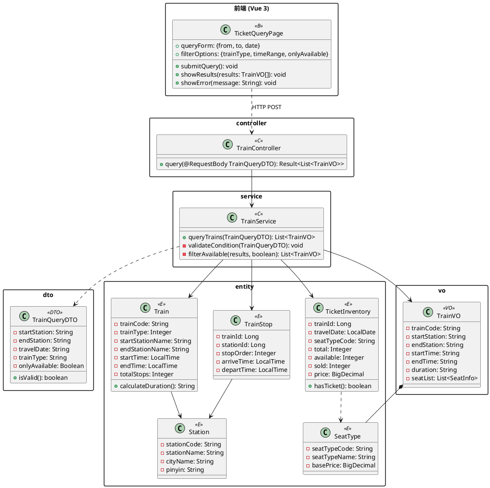
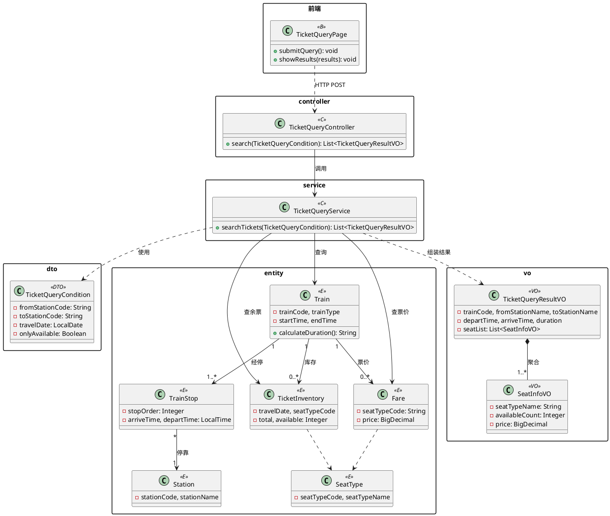

# 案例02：AI+PlantUML生成"车票查询"设计类图

> **适用章节**：10.4.3 构造设计类图
> **工具形式**：通用大模型 + PlantUML / VS Code PlantUML插件
> **案例功能**：车票查询
> **来源文档**：12306_AI辅助软件开发案例_10-13章_全量补齐版

---

## 1. 案例背景

在获得车票查询用例实现方案（案例01）后，需将参与类转化为可渲染、可修改、可版本管理的设计类图。PlantUML代码比图片更适合AI生成和版本控制。

本案例对应项目实际文件：[TrainController.java](../../backend/src/main/java/com/railway/controller/TrainController.java)（项目用名）和 [TicketQuery.vue](../../frontend/src/views/TicketQuery.vue)。为贴近教材"车票查询"语义，AI输出采用 `TicketQuery*` 命名体系。

---

## 2. 设计思想

**让AI输出PlantUML代码而非不可编辑的图片**，可把AI输出转化为标准化设计制品。

AI生成的类图通常只是"可用初稿"，人工审查应关注：
1. **名实相符**：类名和方法名是否准确反映业务功能
2. **职责单一**：每个类是否只承担一种明确的职责
3. **关系完整**：类之间的关联、依赖、组合是否标注清楚
4. **层次分明**：边界类、控制类、实体类是否各司其职

本案例采用 **"AI初稿 → 人工审查 → 精化终稿"** 的教材写法。

---

## 3. 工具输入 / 提示词输入

```
### 任务描述
请根据12306软件"车票查询"用例实现方案，生成软件详细设计阶段的PlantUML设计类图代码。

### 已识别类（来自案例01）
TicketQueryPage(边界类)、Controller(控制类)、Service(控制类)、
查询条件DTO(值对象)、Station(实体类)、Train(实体类)、TrainStop(实体类)、
SeatType(实体类)、余票库存(实体类)、票价(实体类)、结果VO(DTO)

### 设计要求
1. 使用 <<B>> <<C>> <<E>> <<VO>> <<DTO>> 标记类类型
2. 为每个类补充关键属性和方法
3. 标明类之间的依赖（..>）、关联（-->）、聚合（*--），并标注多重性（1, 0..*, 1..*）
4. 车票查询涉及余票和票价两类不同数据，不要混在同一实体中
5. 不加入订单、支付、退票等与当前用例无关的类
6. Service 层应返回领域结果对象，而非直接返回 VO
7. 输出PlantUML代码，并在 @enduml 后附设计说明
```

---

## 4. AI输出 / 工具输出示例（初稿）

以下为AI根据提示词生成的**初始类图**：



**AI初稿设计说明**：AI能较好地识别分层结构（前端/Controller/Service/Entity/VO）和核心链路 `TicketQueryPage → TrainController → TrainService → Train/TrainStop/TicketInventory → TrainVO`。但命名偏"车次查询"、余票与票价混在 `TicketInventory`、缺少多重性和 Repository 层。

---

## 5. 人工审查：AI信息过载与人工裁剪

### 5.1 AI精化后的输出

将初稿问题反馈给AI进行第二轮精化后，AI输出了以下版本。

> ⚠️ **这个版本作为开发内部设计可以接受，但放在教材正文里太复杂了。** AI补充了Repository层、中间DTO、Validator等大量细节，一张图同时包含前端页面、Controller、Service、Validator、Repository、DTO、Result、VO、Entity，成了"系统分层架构图 + 类图 + 数据模型图"的混合体。读者会被大量线条淹没，反而看不清核心的用例协作关系。

<details>
<summary>点击展开：AI精化后的完整类图</summary>

```plantuml
@startuml AI精化后(过度扩展)
skinparam packageStyle rectangle

package "前端" { class TicketQueryPage <<B>> { +submitQuery(): void +showResults(results): void } }
package "controller" { class TicketQueryController <<C>> { +search(condition): Result } }
package "service" { class TicketQueryService <<C>> { +searchTickets(condition): Result } class TicketQueryValidator <<C>> { +validate(condition): void } }
package "dto" { class TicketQueryCondition <<DTO>> { -fromStationCode, toStationCode -travelDate, trainType, onlyAvailable } class TicketQueryResult <<DTO>> { -trains, totalCount } class TrainSummary <<DTO>> { -trainCode, fromStop, toStop -seats, duration } class StationStop <<DTO>> { -stationName, departTime } class SeatAvailability <<DTO>> { -seatTypeCode, availableCount -price } }
package "repository" { class TrainRepository <<R>> { +findByRoute(...) } class TrainStopRepository <<R>> { +findByTrainId(...) } class TicketInventoryRepository <<R>> { +findByTrainAndDate(...) } class FareRepository <<R>> { +findByTrainAndSeatType(...) } }
package "entity" { class Station <<E>> { -stationCode, stationName } class Train <<E>> { -trainCode, trainType -startTime, endTime } class TrainStop <<E>> { -stopOrder, arriveTime, departTime } class SeatType <<E>> { -seatTypeCode, seatTypeName } class TicketInventory <<E>> { -travelDate, total, available } class Fare <<E>> { -fromStationCode, toStationCode -seatTypeCode, price } }
package "vo" { class TicketQueryResultVO <<VO>> { -trainCode, fromStationName -toStationName, duration -seatList } class SeatInfoVO <<VO>> { -seatTypeName, availableCount -price, displayText } }

TicketQueryPage ..> TicketQueryController
TicketQueryController --> TicketQueryService
TicketQueryService --> TrainRepository
TicketQueryService --> TrainStopRepository
TicketQueryService --> TicketInventoryRepository
TicketQueryService --> FareRepository
TicketQueryService --> TicketQueryValidator
Train "1" --> "1..*" TrainStop
TrainStop "*" --> "1" Station
Train "1" --> "0..*" TicketInventory
Train "1" --> "0..*" Fare
TicketQueryResultVO "1" *-- "1..*" SeatInfoVO
@enduml
```

</details>

### 5.2 人工裁剪：做减法

10.4.3 小节只需要说明"车票查询用例由哪些核心设计类协作完成"，不是展示全部实现细节。人工审查后对AI输出做减法：

| 删除 | 原因 |
|------|------|
| Repository 层（4个类） | 数据访问细节适合放在 10.6.4（数据操作设计） |
| `TicketQueryResult`、`TrainSummary`、`SeatAvailability`、`StationStop` | 中间 DTO，增加信息量但对理解用例协作帮助不大 |
| `TicketQueryValidator` | 校验职责可简述为 Service 的私有方法 |

**保留 12 个核心类**：页面 → Controller → Service → 条件DTO → 6个实体（Train/TrainStop/Station/TicketInventory/SeatType/Fare） → 2个VO（TicketQueryResultVO/SeatInfoVO）。

### 5.3 裁剪后的核心类图（教材正文用）



**核心协作链路**：`页面 → Controller → Service → Train / TicketInventory / Fare → ResultVO + SeatInfoVO`。读者一眼看懂：输入查询条件 → 查车次与余票票价 → 组装结果返回。

### 5.4 AI初稿问题分析
|----------|---------|------|----------|
| Controller/Service 命名 | `TrainController`/`TrainService` | 语义偏"车次管理"，非"车票查询" | 改为 `TicketQueryController`/`TicketQueryService` |
| `TicketInventory` | 同时含 `available`/`sold` 和 `price` | 余票和票价混在同一实体 | 拆出独立的 `Fare` 类 |
| `TrainVO.seatList` | `List<SeatInfo>` | `SeatInfo` 未在图中定义 | 补充 `SeatInfoVO` 类 |
| 类关系 | 无多重性标注 | 无法表达业务语义 | 补充 `1`/`1..*`/`0..*` |

### 5.5 教材表述建议

> AI在精化类图时能够较完整地补充Controller、Service、DTO、VO、Repository和Entity等设计元素，说明其具备较强的结构扩展能力。但AI输出存在**信息过载**问题：一张图中同时包含前端交互、服务层调用、数据访问、领域实体和返回对象，类图复杂度较高，不利于读者理解用例实现的核心协作关系。因此，开发者需要根据说明目标对AI输出进行**裁剪**——将Repository层和中间DTO移至数据设计小节，仅在本节保留与用例直接相关的核心设计类。AI可以帮助生成大量设计细节，但**人负责决定哪些信息在什么位置出现**。

---

## 6. 项目实际代码对照

| 图中的名称 | 项目实际类名/文件 | 说明 |
|-----------|-------------------|------|
| `TicketQueryController` | [TrainController.java](../../backend/src/main/java/com/railway/controller/TrainController.java) | 项目用 `TrainController` |
| `TicketQueryService` | [TrainService](../../backend/src/main/java/com/railway/service/TrainService.java) | 项目用 `TrainService` |
| `TicketQueryCondition` | [TrainQueryDTO.java](../../backend/src/main/java/com/railway/dto/TrainQueryDTO.java) | 查询条件DTO |
| `TicketQueryResultVO` | [TrainVO.java](../../backend/src/main/java/com/railway/vo/TrainVO.java) | 查询结果VO |
| `TicketQueryPage` | [TicketQuery.vue](../../frontend/src/views/TicketQuery.vue) | 前端查询页面 |
| `TicketInventory` / `SeatType` | [schema.sql](../../database/schema.sql) 中对应表 | 余票/席别 |
| 数据访问 | [TrainMapper.java](../../backend/src/main/java/com/railway/mapper/TrainMapper.java) 等 | MyBatis-Plus Mapper |

> 完整对照见 [类名映射表](类名映射表-设计名与实际项目类名对照.md)

---

## 7. 使用建议

1. **提示词里给类的清单，别让AI自己猜**：如果已经有了用例实现方案，直接把已识别的类名列给AI，让它聚焦在补属性和画关系上。AI凭空列类容易多出无关类或漏掉关键类
2. **先要PlantUML代码，再渲染成图**：不要直接让AI生成图片。PlantUML代码可以 diff、可以入 Git、可以反复修改，比图片更适合迭代
3. **AI输出的类图默认会"偏满"**：AI倾向于把知道的都画进去。拿到图后先做减法——把与当前用例无关的类、下一阶段才需要的细节（如 Repository）删掉
4. **检查关系箭头是否和文字描述一致**：AI画的关系线有时和它自己的设计说明矛盾。例如文字说"Service 调用 Mapper"，图上却画成了关联线而非依赖线
5. **多重性标注让 AI 补，但要人工核实**：`1..*`、`0..*` 这类标注 AI 能自动生成，但容易把"可有可无"画成"必须有"。特别是可选关联（如某些车次可能没有余票数据），应标注为 `0..*`
6. **类图渲染后用项目实际类名对照一遍**：AI 输出的类名（如 `TicketQueryController`）可能与项目代码中实际名称（如 `TrainController`）不一致。对照表应作为类图的一部分保留
7. **一张图不超过15个类**：超过这个数量就考虑拆图。本案例最终裁剪为12个类，核心链路一目了然

---

*文档生成时间：2026-07-06*
*生成工具：Claude Code + PlantUML*
