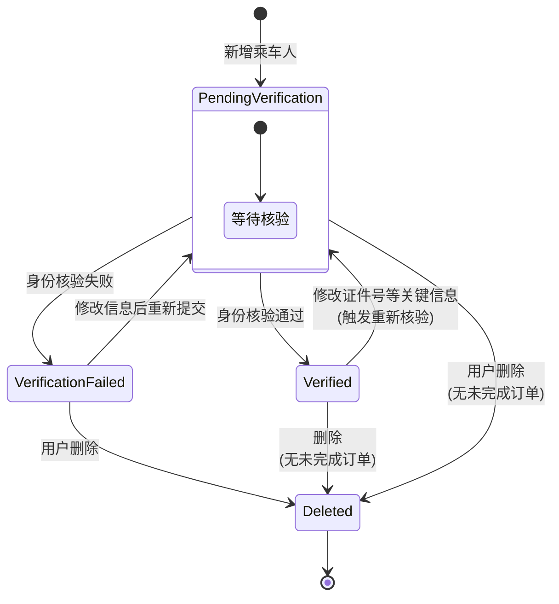

# 案例06：AI+Mermaid生成"乘车人"对象状态转换图

> **适用章节**：10.5.6 构造类对象的状态图
> **工具形式**：通用大模型 + Mermaid 状态图
> **案例功能**：乘车人管理
> **来源文档**：12306_AI辅助软件开发案例_10-13章_全量补齐版

---

## 1. 案例背景

乘车人对象不是静态数据，可能经历新建→待核验→核验通过/失败→修改后重新核验→删除等状态。状态图明确对象生命周期，避免非法状态转换（如已删除的乘车人被用于购票）。

对应项目中 `passengers` 表的 `is_verified` 字段（[schema.sql](../../database/schema.sql)）当前仅用 0/1 表示核验状态，后续可按状态图重构。

---

## 2. 设计思想

根据业务规则生成 Mermaid 状态图，比自然语言描述更直观。提示词明确"已删除不可恢复"、"修改关键信息触发重新核验"等规则，约束AI输出合法转换。

---

## 3. 工具输入 / 提示词输入

```
### 任务描述
请为12306软件中的Passenger乘车人对象构造状态图。

### 业务规则
1. 用户新增乘车人后，乘车人进入"待核验"状态
2. 身份信息核验成功后，进入"已通过"状态，可用于购票
3. 核验失败后，进入"核验失败"状态，用户可修改信息后重新提交核验
4. 对"已通过"的乘车人修改证件号等关键信息后，需重新核验（回到"待核验"）
5. 删除乘车人前需检查是否存在未完成订单（待支付/已支付未出行）
6. 已删除乘车人不可购票，也不允许恢复到任何业务状态
7. 乘客类型变更（如儿童→成人）不触发重新核验

### 输出要求
1. Mermaid stateDiagram-v2 代码
2. 每个状态的含义说明
3. 不允许的状态转换列表
```

---

## 4. AI输出 / 工具输出示例



**状态说明**：

| 状态 | 含义 | 是否可购票 | is_verified 映射值 |
|------|------|-----------|-------------------|
| `PendingVerification` | 待核验：乘车人已提交，身份信息待系统/人工核验 | ❌ 不可购票 | 0 |
| `Verified` | 已通过：身份核验通过，可用于购票和订单关联 | ✅ 可购票 | 1 |
| `VerificationFailed` | 核验失败：身份信息核验未通过，需修改后重试 | ❌ 不可购票 | 2（需新增） |
| `Deleted` | 已删除：逻辑删除，不再用于任何业务 | ❌ 不可购票 | 逻辑删除标记 |

**不允许的状态转换**：

| 非法转换 | 原因 |
|----------|------|
| `Deleted → Verified` | 已删除不可恢复 |
| `Deleted → PendingVerification` | 同上 |
| `VerificationFailed → Verified` | 必须经过修改和重新核验 |
| `VerificationFailed → 直接购票` | 核验失败不可用于购票 |
| `Verified 有未完成订单 → Deleted` | 需先处理订单（取消/出行完成） |

**与项目的映射**：

- 当前数据库 `passengers.is_verified` 仅为 TINYINT（0/1），状态图建议扩展为枚举（0待核验/1已通过/2失败）
- Project 已有 `PassengerServiceImpl` 处理增删改查，触发状态转换的判断逻辑应集中在Service层
- 前端 `Passengers-Mobile.vue` 的核验状态展示（待核验黄色/已通过绿色/失败红色）已预留给出的3种状态

---

## 5. 使用建议

1. **状态图驱动数据库设计**：应将 `is_verified` 改为 `verification_status` 枚举字段
2. **状态转换日志化**：关键状态变化（通过→待核验）应记录到日志或 `passenger_audit` 审计表
3. **前后端状态码对齐**：前端展示的颜色/图标枚举应与后端枚举值一致
4. **修改触发重新核验的字段范围**：仅证件号触发？还是姓名+证件号+证件类型都触发？需产品确认

---

*文档生成时间：2026-07-06*
*生成工具：Claude Code + Mermaid*
*项目代码来源：Passenger.java(is_verified), PassengerServiceImpl.java, Passengers-Mobile.vue*
