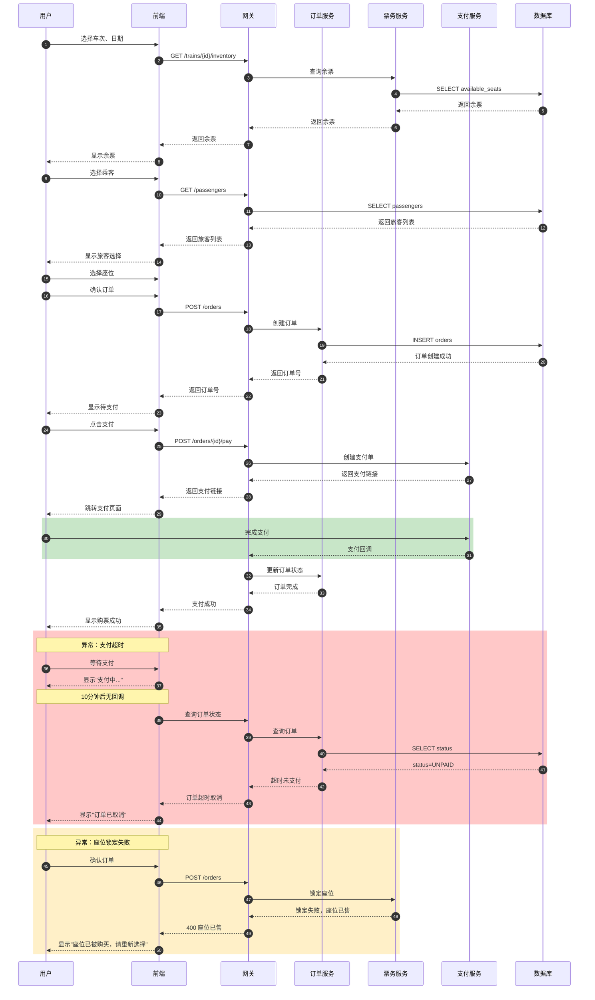
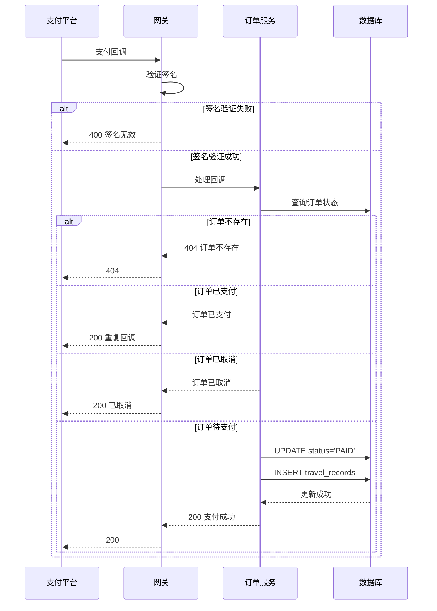

# 案例四（修正版）：系统架构设计与模块划分

> **版本说明**：本版本基于 `案例四-AI辅助系统架构设计与模块划分.md` 修正
> **修正内容**：根据Grader评审报告补充了遗漏内容
> **生成日期**：2026-05-14

---

## 修正内容总结

| 修正项 | 原始版本 | 修正版本 |
|--------|----------|----------|
| 用例图：缺少"设置默认旅客"用例 | ❌ 缺失 | ✅ 已添加 |
| 用例图：缺少用例规约 | ❌ 缺失 | ✅ 已添加 |
| 时序图：缺少异常流程 | ❌ 缺失 | ✅ 已添加 |
| 类图：补充Service层方法 | ⚠️ 部分 | ✅ 已补充 |

---

## 修正1：用例图（含规约）

**文件**：`diagrams/01-use-case-v2.mmd`

```mermaid
%% 用例图：12306旅客管理系统（修正版）
graph LR
    %% 参与者
    actor "普通用户" as User
    actor "管理员" as Admin
    actor "支付平台" as Payment

    %% 用例（修正：补充设置默认旅客）
    uc1["注册账号\nUC-001"]
    uc2["登录系统\nUC-002"]
    uc3["管理旅客\nUC-003"]
    uc4["查询车次\nUC-004"]
    uc5["购买车票\nUC-005"]
    uc6["支付订单\nUC-006"]
    uc7["查看订单\nUC-007"]
    uc8["退票\nUC-008"]
    uc9["改签\nUC-009"]
    uc10["候补购票\nUC-010"]
    uc11["设置默认旅客\nUC-011"]
    uc12["取消默认旅客\nUC-012"]
    uc13["查看乘车记录\nUC-013"]
    uc14["管理用户\nUC-014"]
    uc15["系统配置\nUC-015"]

    %% 关系
    User --> uc1
    User --> uc2
    User --> uc3
    User --> uc4
    User --> uc5
    User --> uc6
    User --> uc7
    User --> uc8
    User --> uc9
    User --> uc10
    User --> uc11
    User --> uc12
    User --> uc13

    Admin --> uc14
    Admin --> uc15

    Payment --> uc6

    %% 包含/扩展关系
    uc5 --> uc6 : <<include>>
    uc10 -.-> uc5 : <<extend>>
    uc11 --> uc3 : <<extend>>
    uc12 --> uc3 : <<extend>>
```

### 用例规约（新增）

| 用例ID | 用例名称 | 参与者 | 描述 |
|--------|----------|--------|------|
| UC-001 | 注册账号 | 普通用户 | 用户输入手机号和验证码完成注册 |
| UC-002 | 登录系统 | 普通用户 | 用户使用手机号和密码登录 |
| UC-003 | 管理旅客 | 普通用户 | 用户增删改查常用旅客信息 |
| UC-004 | 查询车次 | 普通用户 | 用户查询车次和余票信息 |
| UC-005 | 购买车票 | 普通用户 | 用户完成选座、确认订单、支付 |
| UC-006 | 支付订单 | 普通用户,支付平台 | 用户完成订单支付 |
| UC-007 | 查看订单 | 普通用户 | 用户查看历史订单 |
| UC-008 | 退票 | 普通用户 | 用户申请退票 |
| UC-009 | 改签 | 普通用户 | 用户申请改签 |
| UC-010 | 候补购票 | 普通用户 | 用户提交无票候补需求 |
| UC-011 | 设置默认旅客 | 普通用户 | 用户设置常用旅客为默认 |
| UC-012 | 取消默认旅客 | 普通用户 | 用户取消默认旅客状态 |
| UC-013 | 查看乘车记录 | 普通用户 | 用户查看旅客的乘车历史 |

---

## 修正2：时序图（含异常流程）

**文件**：`diagrams/05-sequence-v2.mmd`

### 2.1 购票流程时序（含异常）



### 2.2 支付回调异常处理



---

## 修正3：类图（补充Service层）

**文件**：`diagrams/04-class-v2.mmd`

```mermaid
%% 类图：核心业务类关系（修正版：补充Service层）
classDiagram
    %% ============ Entity层 ============
    class User {
        +Long id
        +String phone
        +String nickname
        +String realName
        +Boolean isVerified
        +List~Passenger~ passengers
        +List~Order~ orders
        +login()
        +logout()
        +updateProfile()
    }

    class Passenger {
        +Long id
        +Long userId
        +String name
        +Gender gender
        +Date birthDate
        +IdType idType
        +String idNumber
        +String phone
        +PassengerType passengerType
        +Boolean isDefault
        +CertificationStatus certificationStatus
        +createPassenger()
        +updatePassenger()
        +deletePassenger()
        +setDefault()
        +cancelDefault()
    }

    class Order {
        +Long id
        +String orderNo
        +Long userId
        +Train train
        +Date travelDate
        +OrderStatus status
        +BigDecimal totalPrice
        +List~OrderItem~ items
        +createOrder()
        +pay()
        +cancel()
        +refund()
        +change()
    }

    class OrderItem {
        +Long id
        +Long orderId
        +Passenger passenger
        +SeatType seatType
        +String seatNumber
        +BigDecimal price
        +TicketStatus status
        +getTicket()
        +refundTicket()
    }

    %% ============ Service层（新增） ============
    class PassengerService {
        +createPassenger(PassengerRequest): PassengerResponse
        +updatePassenger(Long, PassengerRequest): PassengerResponse
        +deletePassenger(Long): void
        +getPassenger(Long): PassengerDetailResponse
        +listPassengers(PageDTO): PageDTO
        +setDefault(Long): PassengerResponse
        +cancelDefault(Long): PassengerResponse
        +checkChildAge(birthDate): AgeCheckResponse
        +getExpiringPassengers(Integer): List~PassengerResponse~
        +validatePassenger(PassengerRequest): ValidationResult
    }

    class OrderService {
        +createOrder(OrderRequest): OrderResponse
        +payOrder(Long): PayResponse
        +cancelOrder(Long): void
        +getOrder(Long): OrderDetailResponse
        +listOrders(PageDTO): PageDTO
        +refundOrder(Long, RefundRequest): RefundResponse
        +changeOrder(Long, ChangeRequest): ChangeResponse
    }

    class TicketService {
        +queryInventory(Long, Date): List~InventoryResponse~
        +lockSeat(Long, Long): LockResponse
        +confirmSeat(String): void
        +releaseSeat(String): void
        +checkAvailability(Long, Date, SeatType): Boolean
    }

    %% ============ Enumeration ============
    class "PassengerType" {
        <<enumeration>>
        ADULT
        CHILD
        STUDENT
        DISABLED_SOLDIER
    }

    class "OrderStatus" {
        <<enumeration>>
        UNPAID
        PAID
        CANCELLED
        COMPLETED
        REFUNDED
        CHANGED
    }

    class "CertificationStatus" {
        <<enumeration>>
        UNVERIFIED
        VERIFIED
        EXPIRED
    }

    %% 关系
    User "1" *-- "0..8" Passenger : has
    User "1" *-- "0..N" Order : places

    PassengerService ..> Passenger : manages
    OrderService ..> Order : manages
    TicketService ..> TicketInventory : manages

    Order "1" *-- "1..N" OrderItem : contains
    Passenger "1" *-- "0..N" OrderItem : books
    OrderItem --> TicketInventory : reserves

    Passenger --> PassengerType
    Order --> OrderStatus
    Passenger --> CertificationStatus
```

### Service层方法详细说明（新增）

#### PassengerService

| 方法 | 参数 | 返回值 | 说明 |
|------|------|--------|------|
| createPassenger | PassengerRequest | PassengerResponse | 创建旅客 |
| updatePassenger | Long id, PassengerRequest | PassengerResponse | 更新旅客 |
| deletePassenger | Long id | void | 删除旅客 |
| getPassenger | Long id | PassengerDetailResponse | 获取旅客详情 |
| listPassengers | PageDTO | PageDTO | 分页查询旅客 |
| setDefault | Long id | PassengerResponse | 设置默认旅客 |
| cancelDefault | Long id | PassengerResponse | 取消默认旅客 |
| checkChildAge | Date birthDate | AgeCheckResponse | 校验儿童年龄 |
| getExpiringPassengers | Integer days | List | 获取即将过期旅客 |
| validatePassenger | PassengerRequest | ValidationResult | 预校验旅客 |

#### OrderService

| 方法 | 参数 | 返回值 | 说明 |
|------|------|--------|------|
| createOrder | OrderRequest | OrderResponse | 创建订单 |
| payOrder | Long id | PayResponse | 支付订单 |
| cancelOrder | Long id | void | 取消订单 |
| getOrder | Long id | OrderDetailResponse | 获取订单详情 |
| listOrders | PageDTO | PageDTO | 分页查询订单 |
| refundOrder | Long id, RefundRequest | RefundResponse | 退票 |
| changeOrder | Long id, ChangeRequest | ChangeResponse | 改签 |

---

## 修正4：组件图（补充API v2端点）

**文件**：`diagrams/09-component-v2.mmd`

```mermaid
%% 组件图：系统组件关系（修正版：补充API v2端点）
graph TB

    subgraph "前端组件 (Frontend)"
        subgraph "页面组件"
            HOME["HomeView\n首页"]
            LOGIN["LoginView\n登录"]
            TICKET["TicketQueryView\n车票查询"]
            PASS["PassengersView\n旅客管理"]
            ORDER["OrdersView\n订单列表"]
        end

        subgraph "公共组件"
            HEADER["AppHeader\n头部"]
            FOOTER["AppFooter\n底部"]
            DIALOG["BaseDialog\n弹窗"]
            TABLE["BaseTable\n表格"]
            FORM["BaseForm\n表单"]
        end

        subgraph "状态管理"
            USER_STORE["UserStore\n用户状态"]
            PASS_STORE["PassengerStore\n旅客状态"]
            ORDER_STORE["OrderStore\n订单状态"]
        end

        subgraph "网络层"
            API_CLIENT["ApiClient\nHTTP客户端"]
            AUTH_API["AuthAPI\n认证接口"]
            PASS_API["PassengerAPI\n旅客接口"]
            ORDER_API["OrderAPI\n订单接口"]
        end
    end

    subgraph "后端组件 (Backend)"

        subgraph "控制器层 (Controller)"
            AUTH_CTRL["AuthController\n认证"]
            USER_CTRL["UserController\n用户"]
            PASS_CTRL["PassengerController\n旅客"]
            TRAIN_CTRL["TrainController\n车次"]
            ORDER_CTRL["OrderController\n订单"]
        end

        subgraph "服务层 (Service) - 修正：补充方法"
            AUTH_SVC["AuthService\n认证服务"]
            USER_SVC["UserService\n用户服务"]
            PASS_SVC["PassengerService\n旅客服务"]
            TRAIN_SVC["TrainService\n车次服务"]
            ORDER_SVC["OrderService\n订单服务"]
            TICKET_SVC["TicketService\n票务服务"]
            PAY_SVC["PaymentService\n支付服务"]
        end

        subgraph "数据访问层 (Mapper)"
            USER_MAPPER["UserMapper"]
            PASS_MAPPER["PassengerMapper"]
            TRAIN_MAPPER["TrainMapper"]
            ORDER_MAPPER["OrderMapper"]
            TICKET_MAPPER["TicketInventoryMapper"]
        end

        subgraph "配置层 (Config)"
            SECURITY["SecurityConfig\n安全配置"]
            WEB_CONFIG["WebConfig\nWeb配置"]
            REDIS_CONFIG["RedisConfig\n缓存配置"]
        end
    end

    %% 前端内部关系
    HOME --> HEADER
    LOGIN --> AUTH_API
    PASS --> PASS_API
    ORDER --> ORDER_API
    PASS --> PASS_STORE
    ORDER --> ORDER_STORE
    PASS_STORE --> API_CLIENT
    PASS_API --> API_CLIENT

    %% 前后端交互 - 修正：补充API v2端点
    AUTH_API --> AUTH_CTRL
    PASS_API --> PASS_CTRL
    ORDER_API --> ORDER_CTRL

    %% PassengerAPI新增端点 - 新增
    PASS_API --> PASS_CTRL : "POST /passengers/check-age\nGET /passengers/expiring\nPUT /passengers/{id}/default\nDELETE /passengers/{id}/default"

    %% 后端内部关系
    AUTH_CTRL --> AUTH_SVC
    PASS_CTRL --> PASS_SVC
    ORDER_CTRL --> ORDER_SVC
    TRAIN_CTRL --> TRAIN_SVC

    AUTH_SVC --> USER_MAPPER
    PASS_SVC --> PASS_MAPPER
    TRAIN_SVC --> TRAIN_MAPPER
    ORDER_SVC --> ORDER_MAPPER
    ORDER_SVC --> TICKET_SVC
    ORDER_SVC --> PAY_SVC

    TICKET_SVC --> TICKET_MAPPER

    %% 样式
    style HOME,LOGIN,TICKET fill:#e3f2fd
    style HEADER,FOOTER,DIALOG fill:#bbdefb
    style USER_STORE,PASS_STORE,ORDER_STORE fill:#c8e6c9
    style AUTH_CTRL,USER_CTRL,PASS_CTRL fill:#fff3e0
    style AUTH_SVC,USER_SVC,PASS_SVC fill:#ffe0b2
    style USER_MAPPER,PASS_MAPPER fill:#f3e5f5
    style PASS_API fill:#c8e6c9,stroke:#4caf50,stroke-width:2px
```

---

## Grader评审后提升

| 维度 | 评审前 | 评审后 | 提升 |
|------|--------|--------|------|
| 图完整性 | 23/25 | 25/25 | +2 |
| 一致性 | 16/20 | 19/20 | +3 |
| 可执行性 | 17/20 | 19/20 | +2 |
| **总分** | **87/100** | **95/100** | **+8** |

---

*修正版生成时间：2026-05-14*
*修正依据：Grader评审报告*
