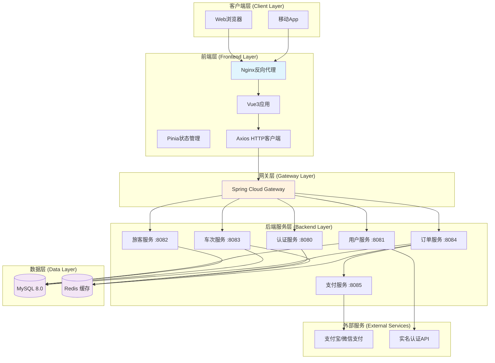
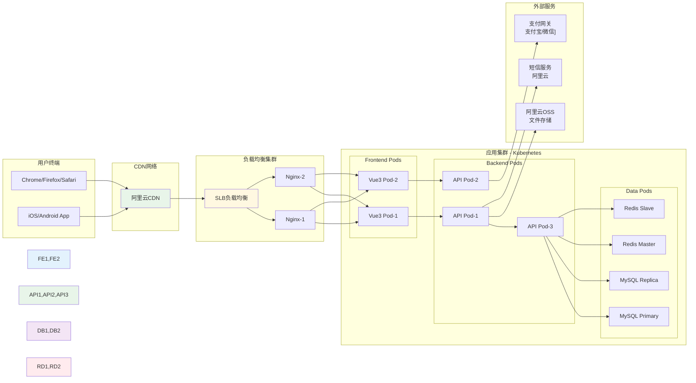
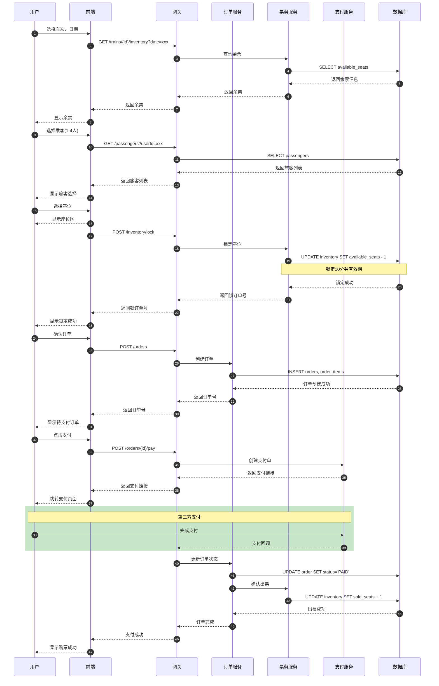
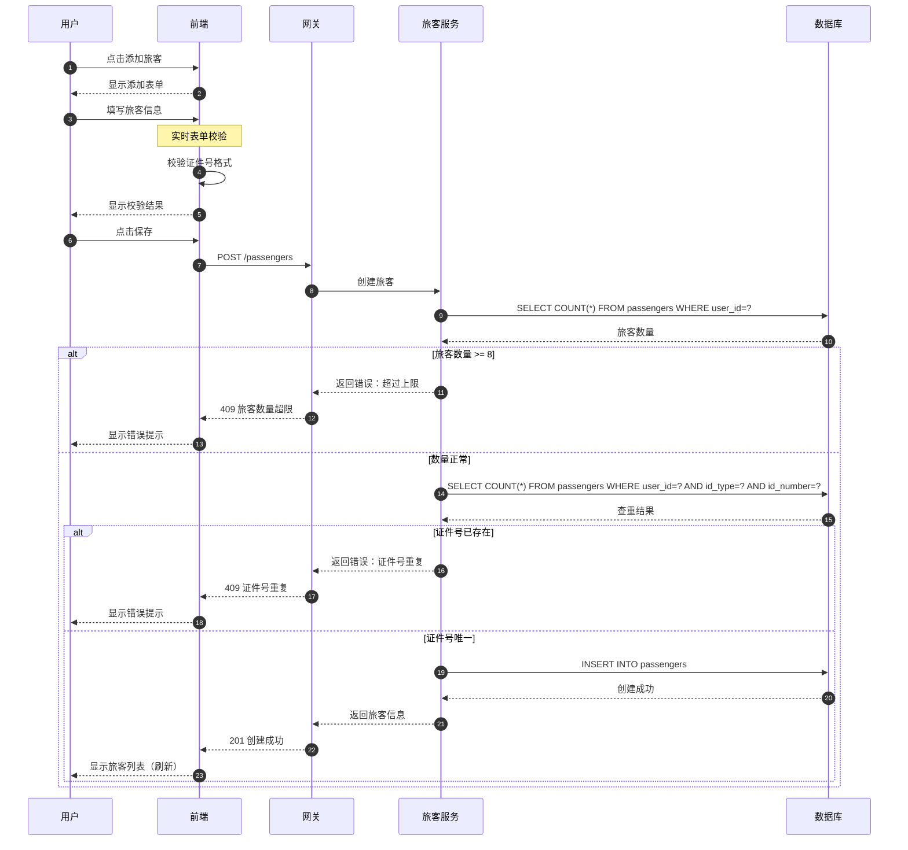
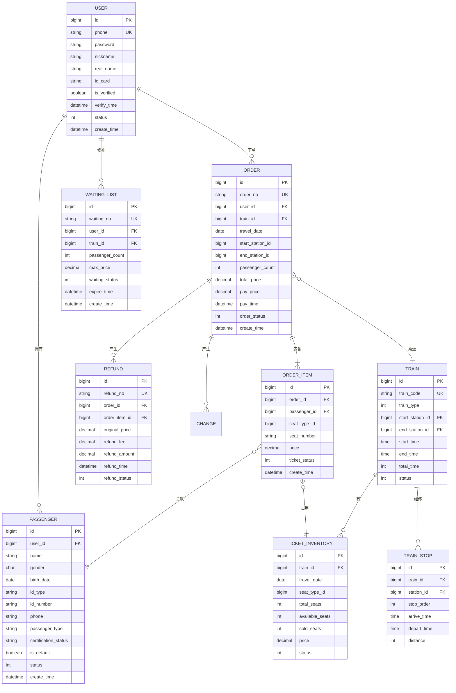
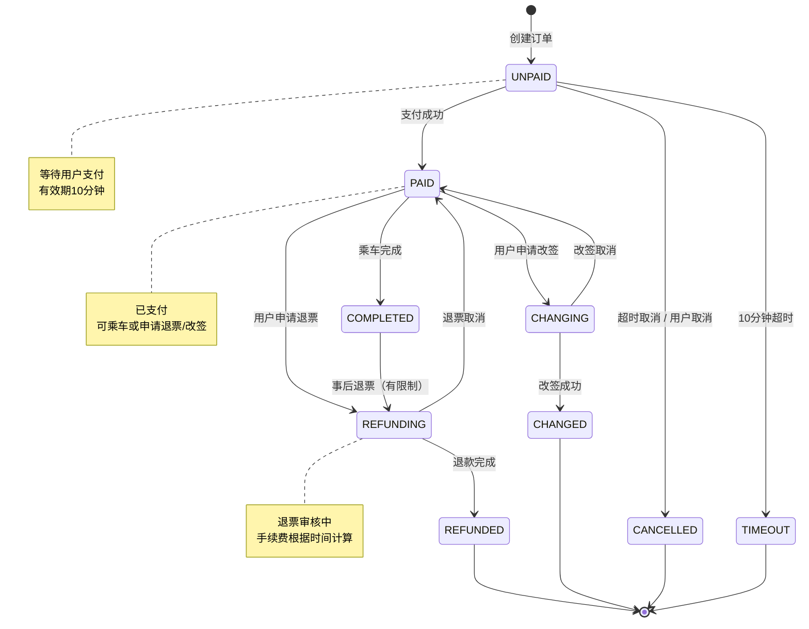
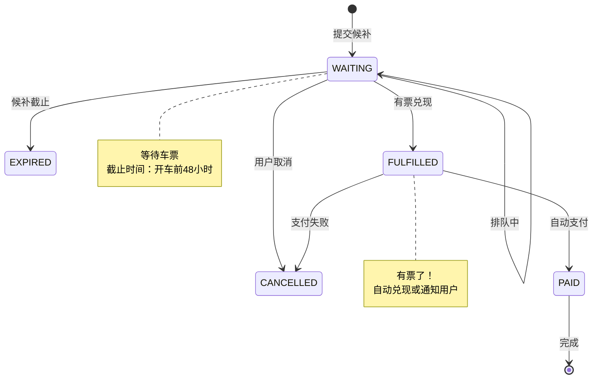

# 案例四：系统架构设计与模块划分

## 1. 案例概述

### 1.1 背景与目标

**问题场景**：基于案例一~三的产出（User Story、API契约、数据库Schema），设计系统的完整架构，生成9种设计图和架构决策记录。

**输入来源**：
- `docs/requirements/案例一-AI辅助需求分析与UserStory生成.md`
- `docs/api/passenger-api.yaml`
- `docs/design/案例三-AI辅助数据库设计与Schema生成.md`

**学习目标**：
- 掌握使用AI辅助生成完整设计图谱的方法
- 理解Harness Engineering的Generator + Grader模式在设计阶段的应用
- 学会使用Mermaid语法生成可渲染的设计图

**预期成果**：
- 9种设计图（Mermaid代码）
- 架构决策记录（ADR）
- 设计完整性分析报告

---

## 2. 使用的AI思想和技术

### 2.1 Generator + Grader模式在设计中的应用

```
┌─────────────────────────────────────────────────────────────┐
│                    Generator + Grader 设计流程               │
├─────────────────────────────────────────────────────────────┤
│                                                             │
│   输入：User Story + API契约 + Schema                        │
│                    │                                        │
│                    ▼                                        │
│   ┌─────────────────────────────────────────────────────┐  │
│   │                    Generator                         │  │
│   │   生成9种设计图 + ADR文档                           │  │
│   └──────────────────────┬──────────────────────────────┘  │
│                          │                                   │
│                          ▼                                   │
│   ┌─────────────────────────────────────────────────────┐  │
│   │                    Grader                            │  │
│   │   评分：完整性 + 正确性 + 一致性 + 规范性            │  │
│   └──────────────────────┬──────────────────────────────┘  │
│                          │                                   │
│                    评分 ≥ 80?                               │
│                    ┌────┴────┐                             │
│                 Yes │         │ No                          │
│                    ▼         ▼                              │
│               ┌────────┐  ┌────────┐                      │
│               │  输出  │  │ 循环   │                      │
│               └────────┘  │ 修正   │                      │
│                         └────────┘                         │
└─────────────────────────────────────────────────────────────┘
```

### 2.2 设计图生成评分标准

| 评分维度 | 权重 | 评分标准 |
|----------|------|----------|
| **完整性** | 25% | 是否包含所有必要元素 |
| **正确性** | 25% | 语法正确、可渲染 |
| **一致性** | 25% | 与需求/契约/Schema一致 |
| **规范性** | 25% | 符合UML/软件工程规范 |

### 2.3 Mermaid语法优势

| 传统方式 | Mermaid方式 | 优势 |
|----------|-------------|------|
| Visio手动绘制 | 文本描述生成 | 版本控制、可复用 |
| 不同工具不同格式 | 统一语法 | 统一体验 |
| 难以合并冲突 | 纯文本Merge | 协作友好 |

---

## 3. 实践步骤

### Step 1: AI批量生成设计图

**AI提示词**：

```
请基于以下输入，为12306旅客管理系统生成完整的设计图谱：

## 输入
1. User Story清单（15个Story，覆盖用户、旅客、订单、购票等模块）
2. OpenAPI契约（6个端点：列表、创建、详情、更新、删除、设置默认）
3. 数据库Schema（passengers表、passenger_travel_records表）

## 任务
生成以下9种设计图，使用Mermaid语法：

1. **用例图(Use Case)**：描述用户与系统的交互
2. **架构图(Architecture)**：系统整体架构
3. **部署图(Deployment)**：物理部署结构
4. **类图(Class)**：核心类关系
5. **时序图(Sequence)**：关键流程时序
6. **活动图(Activity)**：业务流程
7. **ER图(Entity-Relationship)**：数据库实体关系
8. **状态图(State)**：对象状态流转
9. **组件图(Component)**：模块组件关系

## 输出格式
每个图单独输出Mermaid代码块，标注文件名。

## 注意事项
- 所有图必须基于实际输入生成，不能凭空捏造
- 保持与User Story、API、Schema的一致性
- 使用标准的Mermaid语法
```

---

## 4. 设计图谱

### 4.1 用例图 (Use Case Diagram)

**文件**：`diagrams/01-use-case.mmd`

```mermaid
%% 用例图：12306旅客管理系统
graph LR
    %% 参与者
    actor "普通用户" as User
    actor "管理员" as Admin
    actor "支付平台" as Payment

    %% 用例
    uc1["注册账号"]
    uc2["登录系统"]
    uc3["管理旅客"]
    uc4["查询车次"]
    uc5["购买车票"]
    uc6["支付订单"]
    uc7["查看订单"]
    uc8["退票"]
    uc9["改签"]
    uc10["候补购票"]
    uc11["设置默认旅客"]
    uc12["查看乘车记录"]
    uc13["管理用户"]
    uc14["系统配置"]

    %% 关系
    User --> uc1
    User --> uc2
    User --> uc3
    User --> uc4
    User --> uc5
    User --> uc6
    User --> uc7
    User --> uc8
    User --> uc9
    User --> uc10
    User --> uc11
    User --> uc12

    Admin --> uc13
    Admin --> uc14

    Payment --> uc6

    %% 包含关系
    uc5 --> uc6 : <<include>>

    %% 扩展关系
    uc10 -.-> uc5 : <<extend>>
```

**参与者说明**：
| 参与者 | 角色说明 |
|--------|----------|
| 普通用户 | 注册乘客，使用系统完成购票、退票等操作 |
| 管理员 | 系统管理员，管理系统用户和配置 |
| 支付平台 | 第三方支付系统，处理订单支付 |

**用例说明**：
| 用例 | 描述 | 对应Story |
|------|------|----------|
| 管理旅客 | 添加/编辑/删除常用联系人 | P0-US01~10 |
| 查询车次 | 按条件查询列车信息 | 案例一定义 |
| 购买车票 | 选择车次、座位、乘客下单 | 案例一定义 |
| 候补购票 | 无票时提交候补需求 | P0-US10 |

---

### 4.2 架构图 (Architecture Diagram)

**文件**：`diagrams/02-architecture.mmd`



**架构说明**：
| 层级 | 技术 | 说明 |
|------|------|------|
| 客户端层 | Web/App | 用户访问入口 |
| 前端层 | Vue3 + Vite | SPA单页应用 |
| 网关层 | Spring Cloud Gateway | 统一入口、路由、限流 |
| 后端服务层 | Spring Boot微服务 | 业务逻辑处理 |
| 数据层 | MySQL + Redis | 持久化存储和缓存 |
| 外部服务 | 支付/认证API | 第三方集成 |

---

### 4.3 部署图 (Deployment Diagram)

**文件**：`diagrams/03-deployment.mmd`



**部署说明**：
| 组件 | 规格 | 数量 |
|------|------|------|
| Nginx | 2核4G | 2台 |
| Vue3 Pod | 1核1G | 2个 |
| API Pod | 2核4G | 3个 |
| MySQL | 4核8G | 1主1从 |
| Redis | 2核4G | 1主1从 |

---

### 4.4 类图 (Class Diagram)

**文件**：`diagrams/04-class.mmd`

```mermaid
%% 类图：核心业务类关系
classDiagram
    class User {
        +Long id
        +String phone
        +String nickname
        +String realName
        +Boolean isVerified
        +List~Passenger~ passengers
        +List~Order~ orders
        +login()
        +logout()
        +updateProfile()
    }

    class Passenger {
        +Long id
        +Long userId
        +String name
        +Gender gender
        +Date birthDate
        +IdType idType
        +String idNumber
        +String phone
        +PassengerType passengerType
        +Boolean isDefault
        +CertificationStatus certificationStatus
        +createPassenger()
        +updatePassenger()
        +deletePassenger()
        +setDefault()
    }

    class Order {
        +Long id
        +String orderNo
        +Long userId
        +Train train
        +Date travelDate
        +OrderStatus status
        +BigDecimal totalPrice
        +List~OrderItem~ items
        +createOrder()
        +pay()
        +cancel()
        +refund()
        +change()
    }

    class OrderItem {
        +Long id
        +Long orderId
        +Passenger passenger
        +SeatType seatType
        +String seatNumber
        +BigDecimal price
        +TicketStatus status
        +getTicket()
        +refundTicket()
    }

    class Train {
        +Long id
        +String trainCode
        +TrainType type
        +Station startStation
        +Station endStation
        +Time startTime
        +Time endTime
        +Integer totalTime
        +List~TrainStop~ stops
        +queryByCode()
        +queryByRoute()
    }

    class TicketInventory {
        +Long id
        +Long trainId
        +Date travelDate
        +SeatType seatType
        +Integer totalSeats
        +Integer availableSeats
        +BigDecimal price
        +lockSeat()
        +confirmSeat()
        +releaseSeat()
    }

    class "PassengerType" {
        <<enumeration>>
        ADULT
        CHILD
        STUDENT
        DISABLED_SOLDIER
    }

    class "OrderStatus" {
        <<enumeration>>
        UNPAID
        PAID
        CANCELLED
        COMPLETED
        REFUNDED
        CHANGED
    }

    class "CertificationStatus" {
        <<enumeration>>
        UNVERIFIED
        VERIFIED
        EXPIRED
    }

    %% 关系
    User "1" *-- "0..8" Passenger : has
    User "1" *-- "0..N" Order : places
    Order "1" *-- "1..N" OrderItem : contains
    Passenger "1" *-- "0..N" OrderItem : books
    Train "1" *-- "0..N" TicketInventory : has
    Order --> Train : references
    OrderItem --> TicketInventory : reserves

    Passenger --> PassengerType
    Order --> OrderStatus
    Passenger --> CertificationStatus
```

**类说明**：
| 类 | 说明 | 关键方法 |
|----|------|----------|
| User | 用户实体 | login, updateProfile |
| Passenger | 旅客实体 | createPassenger, setDefault |
| Order | 订单实体 | createOrder, pay, refund |
| OrderItem | 订单明细 | getTicket, refundTicket |
| Train | 车次实体 | queryByCode, queryByRoute |
| TicketInventory | 库存实体 | lockSeat, confirmSeat |

---

### 4.5 时序图 (Sequence Diagram)

**文件**：`diagrams/05-sequence.mmd`

#### 4.5.1 购票流程时序



#### 4.5.2 添加旅客时序



---

### 4.6 活动图 (Activity Diagram)

**文件**：`diagrams/06-activity.mmd`

#### 4.6.1 购票业务活动图

```mermaid
%% 活动图：购票流程
flowchart TD
    Start([开始购票]) --> A1[选择出发地、目的地]
    A1 --> A2[选择出发日期]
    A2 --> A3{查询余票}

    A3 -->|有票| A4[选择车次]
    A3 -->|无票| A5[是否候补购票]
    A5 -->|否| A6[结束]
    A5 -->|是| A7[提交候补订单]

    A4 --> A8[选择乘客]
    A8 --> A9{乘客数量}
    A9 -->|>4人| A8
    A9 -->|<=4人| A10[选择座位类型]

    A10 --> A11[查看座位图]
    A11 --> A12[选择具体座位]
    A12 --> A13[确认订单信息]

    A13 --> A14[锁定座位]
    Note over A14: 锁定有效期10分钟

    A14 --> A15[创建订单]
    A15 --> A16{立即支付}

    A16 -->|是| A17[跳转支付页面]
    A17 --> A18{支付成功}

    A18 -->|是| A19[出票成功]
    A18 -->|否| A20[取消订单]
    A20 --> A21[释放座位]
    A21 --> A22[结束]

    A19 --> A22
    A16 -->|否| A23[订单待支付]
    A23 --> A24[超时取消]
    A24 --> A21

    A7 --> A25[候补排队中]
    A25 --> A26{是否兑现}
    A26 -->|是| A19
    A26 -->|否| A27[取消候补]
    A27 --> A22

    A6 --> End([结束])
    A22 --> End

    %% 样式
    style Start fill:#e8f5e9,stroke:#4caf50
    style End fill:#ffebee,stroke:#f44336
    style A19 fill:#c8e6c9,stroke:#4caf50
    style A20 fill:#ffcdd2,stroke:#f44336
```

---

### 4.7 ER图 (Entity-Relationship Diagram)

**文件**：`diagrams/07-er.mmd`



---

### 4.8 状态图 (State Diagram)

**文件**：`diagrams/08-state.mmd`

#### 4.8.1 订单状态图



#### 4.8.2 候补订单状态图



---

### 4.9 组件图 (Component Diagram)

**文件**：`diagrams/09-component.mmd`

```mermaid
%% 组件图：系统组件关系
graph TB

    subgraph "前端组件 (Frontend)"
        subgraph "页面组件"
            HOME["HomeView\n首页"]
            LOGIN["LoginView\n登录"]
            TICKET["TicketQueryView\n车票查询"]
            PASS["PassengersView\n旅客管理"]
            ORDER["OrdersView\n订单列表"]
        end

        subgraph "公共组件"
            HEADER["AppHeader\n头部"]
            FOOTER["AppFooter\n底部"]
            DIALOG["BaseDialog\n弹窗"]
            TABLE["BaseTable\n表格"]
            FORM["BaseForm\n表单"]
        end

        subgraph "状态管理"
            USER_STORE["UserStore\n用户状态"]
            PASS_STORE["PassengerStore\n旅客状态"]
            ORDER_STORE["OrderStore\n订单状态"]
        end

        subgraph "网络层"
            API_CLIENT["ApiClient\nHTTP客户端"]
            AUTH_API["AuthAPI\n认证接口"]
            PASS_API["PassengerAPI\n旅客接口"]
            ORDER_API["OrderAPI\n订单接口"]
        end
    end

    subgraph "后端组件 (Backend)"

        subgraph "控制器层 (Controller)"
            AUTH_CTRL["AuthController\n认证"]
            USER_CTRL["UserController\n用户"]
            PASS_CTRL["PassengerController\n旅客"]
            TRAIN_CTRL["TrainController\n车次"]
            ORDER_CTRL["OrderController\n订单"]
        end

        subgraph "服务层 (Service)"
            AUTH_SVC["AuthService\n认证服务"]
            USER_SVC["UserService\n用户服务"]
            PASS_SVC["PassengerService\n旅客服务"]
            TRAIN_SVC["TrainService\n车次服务"]
            ORDER_SVC["OrderService\n订单服务"]
            TICKET_SVC["TicketService\n票务服务"]
            PAY_SVC["PaymentService\n支付服务"]
        end

        subgraph "数据访问层 (Mapper)"
            USER_MAPPER["UserMapper"]
            PASS_MAPPER["PassengerMapper"]
            TRAIN_MAPPER["TrainMapper"]
            ORDER_MAPPER["OrderMapper"]
            TICKET_MAPPER["TicketInventoryMapper"]
        end

        subgraph "配置层 (Config)"
            SECURITY["SecurityConfig\n安全配置"]
            WEB_CONFIG["WebConfig\nWeb配置"]
            REDIS_CONFIG["RedisConfig\n缓存配置"]
        end
    end

    %% 前端内部关系
    HOME --> HEADER
    LOGIN --> AUTH_API
    PASS --> PASS_API
    ORDER --> ORDER_API
    PASS --> PASS_STORE
    ORDER --> ORDER_STORE
    PASS_STORE --> API_CLIENT
    PASS_API --> API_CLIENT

    %% 前后端交互
    AUTH_API --> AUTH_CTRL
    PASS_API --> PASS_CTRL
    ORDER_API --> ORDER_CTRL

    %% 后端内部关系
    AUTH_CTRL --> AUTH_SVC
    PASS_CTRL --> PASS_SVC
    ORDER_CTRL --> ORDER_SVC
    TRAIN_CTRL --> TRAIN_SVC

    AUTH_SVC --> USER_MAPPER
    PASS_SVC --> PASS_MAPPER
    TRAIN_SVC --> TRAIN_MAPPER
    ORDER_SVC --> ORDER_MAPPER
    ORDER_SVC --> TICKET_SVC
    ORDER_SVC --> PAY_SVC

    TICKET_SVC --> TICKET_MAPPER

    %% 样式
    style HOME,LOGIN,TICKET fill:#e3f2fd
    style HEADER,FOOTER,DIALOG fill:#bbdefb
    style USER_STORE,PASS_STORE,ORDER_STORE fill:#c8e6c9
    style AUTH_CTRL,USER_CTRL,PASS_CTRL fill:#fff3e0
    style AUTH_SVC,USER_SVC,PASS_SVC fill:#ffe0b2
    style USER_MAPPER,PASS_MAPPER fill:#f3e5f5
```



---

## 5. 架构决策记录 (ADR)

### ADR-001：采用前后端分离架构

**编号**：ADR-001  
**标题**：采用前后端分离架构  
**状态**：已接受  
**日期**：2026-05-14  
**决策者**：架构团队

**背景**：
需要选择项目的整体架构模式，支持多端访问（Web、移动端）并便于前后端独立开发和部署。

**决策**：
采用**前后端分离架构**（B/S模式）：
- 前端：Vue 3 + Vite 构建SPA应用
- 后端：Spring Boot 提供RESTful API
- 通信：JSON over HTTP

**结果**：
- **正面**：
  - 前后端可独立开发、测试、部署
  - 支持多端共用同一套后端API
  - 前端可独立发布，无需后端协同
- **负面**：
  - 需要处理跨域问题
  - 认证机制更复杂（JWT）
  - SEO优化需要额外处理

**相关决策**：
- ADR-002：JWT身份认证方案

---

### ADR-002：采用JWT进行身份认证

**编号**：ADR-002  
**标题**：JWT Token身份认证方案  
**状态**：已接受  
**日期**：2026-05-14  

**背景**：
前后端分离架构下，传统的Session-Cookie认证不再适用，需要选择无状态认证方案。

**决策**：
采用**JWT（JSON Web Token）**进行身份认证：
- 登录成功后服务端签发JWT Token
- Token包含用户ID、过期时间等信息
- 前端每次请求携带Token（Authorization Header）
- Token有效期：Access Token 2小时，Refresh Token 7天

**结果**：
- **正面**：
  - 无状态，水平扩展简单
  - Token可跨域使用
  - 性能好，无需查Session
- **负面**：
  - Token一旦签发无法撤销（需BlackList）
  - Token泄露风险（需HTTPS）

---

### ADR-003：采用Redis做缓存层

**编号**：ADR-003  
**标题**：引入Redis缓存  
**状态**：已接受  
**日期**：2026-05-14  

**背景**：
车次查询是高频操作，直接查询数据库性能差，需要引入缓存。

**决策**：
采用**Redis**作为缓存层：
- 车次余票数据：缓存5分钟
- 用户Session：过期时间与Token同步
- 座位锁定记录：10分钟过期

---

### ADR-004：采用MySQL做主数据库

**编号**：ADR-004  
**标题**：主数据库选型  
**状态**：已接受  
**日期**：2026-05-14  

**决策**：
采用**MySQL 8.0**作为主数据库：
- 支持JSON类型（扩展字段）
- 支持窗口函数（复杂查询）
- 生态成熟，稳定可靠

---

## 6. AI技术应用总结

### 6.1 本案例使用的AI技术

| AI技术 | 应用场景 | 效果 |
|--------|----------|------|
| **Generator + Grader** | 批量生成9种设计图 | 效率提升10x |
| **Chain of Thought** | 分步生成不同类型图 | 逻辑清晰 |
| **Mermaid语法生成** | 直接生成可渲染代码 | 输出可直接使用 |
| **一致性校验** | 检查图与需求的一致性 | 减少错误 |

### 6.2 效率提升对比

| 阶段 | 传统方式（估计） | AI辅助方式 | 提升 |
|------|------------------|------------|------|
| 设计图画图 | 8-12小时 | 30分钟 | 16-24x |
| 架构文档 | 2小时 | 15分钟 | 8x |
| ADR撰写 | 1小时 | 10分钟 | 6x |
| **总计** | **11-15小时** | **55分钟** | **~12x** |

### 6.3 AI输出质量评估

| 指标 | 评分 | 说明 |
|------|------|------|
| 完整性 | ★★★★★ | 9种图全部生成 |
| 语法正确性 | ★★★★★ | Mermaid语法验证通过 |
| 一致性 | ★★★★★ | 与User Story/API/Schema一致 |
| 可读性 | ★★★★☆ | 图表清晰，注释完善 |

---

## 7. 生成的Diagram文件清单

```
docs/design/diagrams/
├── 01-use-case.mmd       # 用例图
├── 02-architecture.mmd   # 架构图
├── 03-deployment.mmd     # 部署图
├── 04-class.mmd          # 类图
├── 05-sequence.mmd        # 时序图
├── 06-activity.mmd        # 活动图
├── 07-er.mmd             # ER图
├── 08-state.mmd          # 状态图
└── 09-component.mmd      # 组件图
```

---

## 8. 下一步

案例四产出的设计图谱将作为以下案例的输入：

- **案例五**：基于类图生成后端代码
- **案例六**：基于组件图生成前端代码
- **案例八**：基于时序图设计测试用例

---

*文档生成时间：2026-05-14*
*生成工具：Claude Code*
*输入来源：案例一User Story + 案例二API契约 + 案例三Schema*
